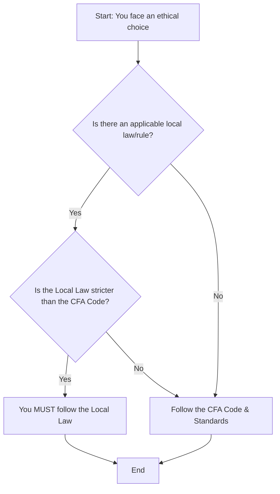

### Part 1: Standard I(A) - Knowledge of the Law 📜

**The Standard:** "Members and Candidates must understand and comply with all applicable laws, rules, and regulations (including the CFA Institute Code of Ethics and Standards of Professional Conduct) of any government, regulatory organization, licensing agency, or professional association governing their professional activities. In the event of conflict, Members and Candidates must comply with the **more strict** law, rule, or regulation. Members and Candidates must not **knowingly** participate or assist in and must **dissociate** from any violation of such laws, rules, or regulations." 

#### 1.1 The Golden Rule: Follow the "More Strict" Law

This is the most critical part of I(A). You are held to the highest possible standard, whether it's from your local regulator or from CFA Institute.

  * If your country's law is *stricter* than the Code and Standards, **you must follow the country's law**.
  * If the Code and Standards are *stricter* than your country's law, **you must follow the Code and Standards**.
  * If your country has *no law* on a particular subject, **you must follow the Code and Standards**.

Here is a simple decision path:

#### 1.2 "Knowing" Participation and Dissociation

You are responsible for violations in which you "knowingly" participate or assist. If you know—or *should know*—that your actions are helping to commit a violation, you are just as guilty.

If you find yourself in a situation where your colleagues or firm are violating the law or the Code, you **must** take action.

**💡 Your Duty to Dissociate (A 3-Step Process)**

This is a classic exam topic. If you suspect illegal or unethical activity, you must:

1.  **Attempt to Stop It:** First, report the activity to your supervisor or your firm's compliance department.
2.  **Step Away (Dissociate):** If the firm does not stop the activity, you have a duty to dissociate. This could mean:
      * Removing your name from research reports or recommendations.
      * Asking for a different assignment.
      * Refusing to continue advising a client.
3.  **Leave (In Extreme Cases):** In extreme cases, dissociation may require you to leave your employment.

**Key Point:** Simply doing nothing ("inaction") while knowing about the violation can be construed as participating in the unethical conduct.

-----

### Part 2: Standard I(B) - Independence and Objectivity ⚖️

**The Standard:** "Members and Candidates must use reasonable care and judgment to achieve and maintain independence and objectivity in their professional activities. Members and Candidates must not offer, solicit, or accept any **gift, benefit, compensation, or consideration** that reasonably could be expected to compromise their own or another's independence and objectivity." 

This standard means your work and opinions must be your own, unaffected by outside pressures.

#### 2.1 Common Threats to Your Objectivity

  * **Gifts from Companies/Brokers:** You must reject any gift or entertainment that is lavish or could be seen as an attempt to influence you. Modest, customary business entertainment is acceptable.
  * **Investment Banking Pressure:** This is a classic conflict. Your firm's investment banking department may pressure you (an analyst) to write a favorable report on a company to win their business. This is a violation. Your recommendation must be based on facts.
  * **Issuer-Paid Research:** This is when an analyst is paid *by the company* to write a research report on it. This is a high-risk area.
      * **To comply:** The analyst should *only* accept a flat, fixed fee that is not tied to the conclusions of the report. The analyst *must* fully disclose the nature of the compensation in the report.
  * **Travel Funding:**
      * **Best Practice:** Always pay your own way, or have your firm pay for travel.
      * **Exception:** If commercial transport is unavailable (e.g., a trip to a remote mine), you *may* accept "modestly arranged travel". Example 1 in the text shows that a chartered flight and "Spartan" motel for a mine tour was acceptable, but a lavish trip would not be.

#### 2.2 The Special Case: Gifts from Clients

What if a *client* gives you a gift to thank you for good performance?

  * This is viewed differently from a gift from a third party seeking to influence you. It can be considered "supplementary compensation".
  * **Your Duty:** You *must* get permission from your employer *before* accepting the gift, or, if that's not possible, disclose it immediately after.
  * **Why?** Your employer needs to know about it to ensure this gift doesn't cause you to favor this one client over other clients (e.g., by giving them better trade allocations).

-----

### Part 3: Standard I(C) - Misrepresentation 🎭

**The Standard:** "Members and Candidates must not **knowingly** make any misrepresentations relating to investment analysis, recommendations, actions, or other professional activities." 

A misrepresentation is any untrue statement, omission of fact, or any statement that is false or misleading. "Knowingly" means you either knew it was false or *should have known*.

#### 3.1 Key Forms of Misrepresentation

  * **Plagiarism:** This is a major violation. You cannot copy or use materials prepared by others without acknowledging the source. This includes:
      * Using excerpts from reports without attribution.
      * Using charts or graphs without citing the source.
      * Presenting someone else's ideas as your own.
  * **Performance Reporting:**
      * You cannot **guarantee** a specific rate of return (unless the product itself has a guarantee, like a bank CD).
      * You cannot state or imply that past performance will be repeated.
      * You cannot engage in "cherry-picking"—presenting only your best-performing accounts as representative of your strategy.
  * **Omissions:** Leaving out key risks, limitations, or negative scenarios from a model can be a misrepresentation.
  * **Credentials & Social Media:** This standard applies to all forms of communication, including websites, social media, and resumes. Lying about your credentials (like in Example 4 ) or your firm's abilities (Example 1 ) is a clear violation.

**🧠 Memory Aid: The "P.O.P." Quiz for Misrepresentation**

Before you publish or speak, check your "P.O.P.":

  * **P** = **Plagiarism:** Did I credit all my sources? 
  * **O** = **Omissions:** Did I leave out any critical facts, risks, or limitations? 
  * **P** = **Performance:** Am I presenting performance fairly, or am I "cherry-picking"  or guaranteeing future results? 

-----

### Part 4: Standard I(D) - Misconduct 🚫

**The Standard:** "Members and Candidates must not engage in any **professional conduct** involving dishonesty, fraud, or deceit or commit any act that reflects adversely on their professional reputation, integrity, or competence." 

This is the "character" standard. It covers any act of lying, cheating, or stealing that reflects poorly on your professional self.

**💡 The CRITICAL Difference: "Professional" vs. "Personal" Conduct**

This standard does *not* govern your entire personal life. It applies to "professional conduct".

  * **What is "Professional Conduct"?**

      * Any conduct at your workplace.
      * Any conduct *outside* the workplace *if* it relates to the investment profession (e.g., writing an investment blog, even personally).
      * Any conduct where you use your CFA designation or membership to lend credibility.
      * Volunteering for CFA Institute or a local society.

  * **Examples:**

      * **Violation:** Abusing alcohol *during business hours* impairs your competence and is misconduct.
      * **Violation:** Submitting fraudulent reimbursement forms to your employer is dishonesty in the workplace.
      * **Violation:** Lying on a resume or in a CFA Institute Professional Conduct Statement.
      * **NOT a Violation:** Generally, acts of civil disobedience (Example 4 ) or personal failings that are not related to your job or the industry (like faking a disability parking permit in Example 8 ) are not covered, *even if they are dishonest*. The act must reflect adversely on your *professional* reputation, integrity, or competence.

-----

### Part 5: Standard I(E) - Competence 🎓

**The Standard:** "Members and Candidates must act with and **maintain** the competence necessary to fulfill their professional responsibilities." 

This standard demands that you have the "sufficient knowledge, skills, and abilities" to do your job successfully.

**💡 Key Exam Tip: A New Standard**

Standard I(E) is a relatively new addition to the Standards of Professional Conduct. It makes the requirement for competence—which was always in the Code of Ethics—an explicit, testable standard.

#### 5.1 The Two Pillars of Competence

1.  **Act with Competence (Today):**

      * You must not take on professional responsibilities if you are not qualified to handle them.
      * If you don't understand an investment (like cryptocurrency in Example 6), you are *not competent* to recommend it or invest in it for clients.
      * This standard does *not* mean you can never make a mistake or lose money. A competent manager can have a bad outcome; an *incompetent* one didn't have the skills to begin with.

2.  **Maintain Competence (Tomorrow):**

      * Competence is not static. You have a duty to "continuously maintain or improve" your skills.
      * The industry evolves (e.g., new products, ESG factors, new models), and you must evolve with it.
      * The standard does *not* require a specific program. You can maintain competence by attending conferences, webinars, earning other certifications, or even diligent self-study.

-----

### 🎯 Quick Exam-Day Pointers

Here is your samurai's cheat sheet for Standard I. Know these cold\!

  * **I(A) - Law:** Always follow the **more strict** rule (local law vs. CFA Code). **Dissociation is mandatory** ; merely reporting a violation to CFA Institute is "strongly encouraged" but not required (unless the law says so).
  * **I(B) - Objectivity:** Watch for **gifts**. Modest is okay. Gifts from *clients* are viewed as supplementary pay, but you *must* disclose them to your *employer* to get permission.
  * **I(B) - Objectivity:** For **issuer-paid research**, the only compliant path is to accept a **flat fee** (not tied to your conclusion) and **fully disclose** the arrangement.
  * **I(C) - Misrepresentation:** Don't **plagiarize**. Remember, you *can* use research and models created by others *at your own firm* without attribution (it's firm property). Don't "cherry-pick" performance  or guarantee returns.
  * **I(D) - Misconduct:** This standard applies to **"professional conduct"**. Being drunk *at work* is a violation. Lying on a resume is a violation. Getting a speeding ticket is not.
  * **I(E) - Competence:** This is a *new* standard. It has two parts: 1) Be competent (don't do work you can't handle)  and 2) **Maintain** competence (keep learning as the industry changes).