## Standard I: Professionalism

### 🎯 Introduction

Welcome, future charterholder\! Think of the CFA Code and Standards as the ultimate rulebook for the investment world. Standard I, **Professionalism**, is the very first chapter, and for good reason—it’s the foundation of everything we do. 🏛️ Just like a doctor must first swear the Hippocratic Oath to "do no harm," an investment professional's first duty is to uphold the integrity of the profession. This standard isn't just a set of rules; it's about building and maintaining trust with clients, employers, and the market itself. Let's dive into the five key pillars that make up this crucial foundation\!

-----

### Standard I(A): Knowledge of the Law 🤔

At its heart, this standard is simple: know the rules and play by them. As an investment professional, you operate in a world governed by laws, regulations, and the CFA Institute Code and Standards. Your job is to understand and comply with all of them.

The golden rule here is the **"more strict" rule**. If your country's law and the CFA Code disagree, you **must** follow the one that imposes greater restrictions or demands a higher degree of action to protect clients.

<!-- tabs:start -->

#### **Theory 🧠**

Imagine you're working in a country where insider trading laws are weak (Country LS: Less Strict), but the CFA Code and Standards have a very strong prohibition against it. You must follow the CFA Code.

Now, imagine you're in a country where the law on IPO allocations is incredibly stringent (Country MS: More Strict), even more so than the CFA Code. In this case, you must follow the country's law.

#### **Global & Local Context 🌍**

  * **Global Example:** Suppose you are a portfolio manager in a country with lax regulations on disclosing referral fees. However, the CFA Code [Standard VI(C)] requires full disclosure. You **must** follow the CFA Code and disclose those fees.
  * **Indian Example:** SEBI (Securities and Exchange Board of India) has very specific rules about how research reports are published and what disclosures are required. If these SEBI rules are stricter than the general guidance in the CFA Code, an analyst in India must follow SEBI's regulations to the letter.

<!-- tabs:end -->

What if you see something illegal happening at your firm? 🧐 You can't just look the other way. You must **dissociate** from the activity. This means you have to take steps to separate yourself from the wrongdoing.

> [\!TIP]
> **CFA Exam Tip ✍️:** The exam *loves* to test the "more strict" rule. You'll likely see a scenario question where you need to compare a local law to the CFA Code and Standards and pick the correct course of action. Remember: **Highest Standard Applies\!** Also, "dissociate" is a keyword to remember; it's your required action when you can't stop an unethical activity.

-----

### Standard I(B): Independence and Objectivity ⚖️

This standard is all about ensuring your work and opinions are your own, untainted by outside influences. Your analysis and investment actions should be based on facts and your professional judgment, not on gifts, pressure from your company, or any other factor that could compromise your **independence and objectivity**.

Think of yourself as an impartial judge. 👨‍⚖️ Your verdict (your investment recommendation) should be based only on the evidence (your research).

Key pressures to watch out for:

  * **Gifts and Entertainment 🎁:** Modest gifts and entertainment are okay, but anything lavish or intended to influence your decisions is a major red flag. Accepting a simple business lunch is fine; accepting an all-expenses-paid trip to Mauritius from a company you cover is not.
      * **Gifts from Clients vs. Third Parties:** Gifts from clients are viewed differently. If a happy client gives you a bonus or a nice gift, it's considered supplemental compensation. You **must**, however, get written permission from your employer *before* accepting it (or disclose it immediately after) to ensure it doesn't create partiality towards that client.
  * **Investment Banking Pressure 🏦:** If you're a research analyst, your firm's investment banking department might pressure you to write a favorable report on a company they want to take public. You must resist this pressure. Your report must be objective.
  * **Issuer Pressure 🗣️:** Companies you cover might threaten to cut off your access to management if you issue a negative report. This is a direct threat to your objectivity.
  * **Issuer-Paid Research 💰:** If a company pays you to write a research report on them, this is a massive conflict. Best practice is to only accept a flat fee that isn't tied to your conclusion and to **fully disclose** the nature of your compensation in the report.

<!-- tabs:start -->

#### **Acceptable vs. Unacceptable ✅/❌**

| Action | Acceptable? | Why? |
| :--- | :--- | :--- |
| Accepting a coffee mug from a company | ✅ | Modest, token gift. Not likely to compromise objectivity. |
| Analyst's firm pays for their flight to visit a company | ✅ | Standard business practice. No compromise. |
| A company charters a private jet for an analyst to visit | ❌ | Lavish travel. Creates an appearance of compromised objectivity. |
| A client offers you tickets to an IPL final after a great year | ✅ (with disclosure) | Must get written consent from your employer first. |

#### **Global & Local Context 🌍**

  * **Global Example:** During the dot-com bubble, analysts at major Wall Street banks were often pressured to maintain "buy" ratings on tech companies that were also lucrative investment banking clients. This is a classic violation of Standard I(B).
  * **Indian Example:** An analyst covering a large conglomerate like the Adani Group might face pressure to maintain a favorable rating to help the firm's investment banking division secure a deal for a new bond issuance. The analyst must remain objective, regardless of this internal pressure.

<!-- tabs:end -->

> [\!TIP]
> **CFA Exam Tip ✍️:** Pay close attention to the source of the gift or pressure. A gift from a client is a **Standard IV(B) - Additional Compensation** issue that requires disclosure to your *employer*. A gift from a third party trying to influence your future work is a **Standard I(B)** issue. The exam will test your ability to differentiate.

-----

### Standard I(C): Misrepresentation 🤥

This standard boils down to one simple concept: **Don't lie.** You must not knowingly make any **misrepresentations** related to your professional activities. This includes lying, omitting crucial facts, or presenting information in a misleading way. Trust is the currency of our profession, and misrepresentation destroys it.

Common areas of misrepresentation include:

  * **Your Credentials:** Don't claim to have a degree you didn't earn or exaggerate your qualifications.
  * **Firm Performance:** Don't "cherry-pick" your best-performing accounts and present them as representative of your overall performance. You must present a fair, accurate, and complete picture.
  * **Guarantees:** Never guarantee a specific rate of return. Investing involves risk, and guaranteeing outcomes is fundamentally misleading.
  * **Plagiarism:** This is a huge one. **Plagiarism** is presenting someone else's work, ideas, or data as your own without giving them credit. Always acknowledge your sources\!

```mermaid
graph TD
    subgraph "Plagiarism Violation"
        A[Analyst Jane reads a report by Analyst Bob] --> B[Jane copies large parts of Bob's report];
        B --> C[She changes a few words and puts her name on it];
        C --> D[VIOLATION ❌];
    end
    subgraph "Proper Attribution"
        E[Jane reads Bob's report] --> F["She quotes a key section and writes, 'According to Bob...'"];
        F --> G[She then adds her own analysis and conclusions];
        G --> H[NO VIOLATION ✅];
    end
```

<!-- end list -->

> [\!TIP]
> **CFA Exam Tip ✍️:** Plagiarism is a frequently tested topic. Remember the two key actions: **Maintain copies** of your source materials and **attribute** everything that isn't your own original thought—quotations, summaries, charts, and ideas. The exam might test a scenario where an analyst uses charts from another source without citing it. That's a clear violation\!

-----

### Standard I(D): Misconduct 🚫

This standard requires you to not engage in any professional conduct involving **dishonesty, fraud, or deceit**. It also says you must not commit any act that reflects adversely on your **professional reputation, integrity, or competence**.

The key here is the focus on **professional conduct**. This standard isn't about your personal life, unless your personal actions are so severe they call your professional integrity into question.

  * **What's covered?** Conduct that is related to your role in the investment industry. Examples include cheating on your expense reports, falsifying company records, or being intoxicated at work while making investment decisions.
  * **What's generally not covered?** Personal activities that don't reflect on your professional abilities. For example, getting a speeding ticket or participating in a peaceful political protest would typically not be a violation. However, being convicted of a serious crime like tax fraud *would* be a violation because it involves dishonesty and reflects directly on your integrity.

<!-- tabs:start -->

#### **Global & Local Context 🌍**

  * **Global Example:** The case of Bernie Madoff is an extreme example of misconduct. He ran a massive Ponzi scheme, a clear act of fraud and deceit that devastated his clients and damaged the reputation of the entire industry.
  * **Indian Example:** The Satyam Computers scandal, where the company's founder Ramalinga Raju admitted to falsifying accounts to the tune of crores, is a prime example of professional misconduct involving fraud that had a massive negative impact on shareholders and the market's perception of corporate governance in India.

<!-- tabs:end -->

> [\!TIP]
> **CFA Exam Tip ✍️:** The line between professional and personal life can be tricky. The exam will test your judgment. Ask yourself: "Does this action involve dishonesty, and does it damage the person's trustworthiness or ability to do their job?" Abusing alcohol *during business hours* is a violation because it affects competence. A DUI on a weekend might not be, unless it leads to a conviction for a crime involving deceit.

-----

### Standard I(E): Competence 🧠

This is the newest addition to Standard I, and its message is powerful: You must **act with and maintain the competence** necessary to do your job. It's not enough to be smart or have a degree; you need the specific knowledge, skills, and abilities to fulfill your professional responsibilities effectively.

This standard has two parts:

1.  **Act with Competence:** Don't take on tasks you're not qualified for. If a client wants to invest in complex derivatives and you're not an expert, you have a duty to either educate yourself, bring in an expert, or decline the task.
2.  **Maintain Competence:** The financial world is always changing. You have a duty to keep learning and stay current. This is the principle of lifelong learning in action\! 📚

<!-- tabs:start -->

#### **Theory 🧠**

A portfolio manager who has only ever managed Indian equities cannot suddenly start managing a global macro hedge fund without first acquiring the necessary skills and knowledge in currency markets, international economics, and complex derivatives. To do so would be a violation of this standard.

#### **Global & Local Context 🌍**

  * **Global Example:** An advisor in the US who starts recommending cryptocurrencies like Bitcoin to clients without deeply understanding blockchain technology, wallet security, and the regulatory landscape would not be acting with competence.
  * **Indian Example:** With the rise of ESG (Environmental, Social, and Governance) investing in India, a fund manager must become competent in analyzing ESG factors for companies like Tata Power or Reliance Industries. Simply ignoring these new, relevant factors or applying old models without adaptation would be a failure to maintain competence.

<!-- tabs:end -->

> [\!TIP]
> **CFA Exam Tip ✍️:** Since this is a newer standard, the exam questions will likely be foundational. Expect scenarios that test whether a professional is qualified for a specific task they are undertaking or if they are keeping their skills up-to-date with market changes. The core idea is simple: **Know your stuff, and keep knowing your stuff.**

-----

> [\!IMPORTANT]
>
> ### 🎯 Quick Exam-Day Pointers
>
>   * **KIM-MC Mnemonic:** A great way to remember the five parts of Standard I is **K**nowledge, **I**ndependence, **M**isrepresentation, **M**isconduct, **C**ompetence.
>   * **Rule \#1:** When law and the Code conflict, the **stricter** one always wins. No exceptions.
>   * **Objectivity is Key:** Don't let gifts, company politics, or personal relationships cloud your judgment. Disclose any potential conflict, or better yet, avoid it.
>   * **Honesty First:** Never misrepresent your skills, your firm's performance, or an investment's characteristics. And absolutely no **plagiarism**.
>   * **Professionalism Extends Beyond the Desk:** Your conduct must uphold the integrity of the profession. Dishonesty in a professional capacity is a clear violation.
>   * **Stay Sharp:** The markets evolve, and so must you. Always maintain and improve your **competence**.