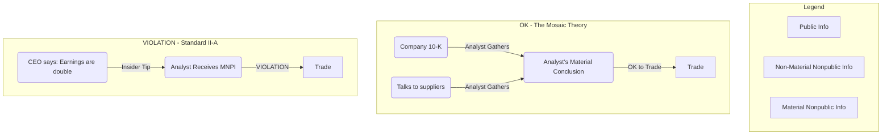

**Standard II: Integrity of Capital Markets** is all about ensuring a fair fight. If investors believe the market is "rigged" by insiders or fraudsters, they won't participate. This erodes trust, makes markets inefficient, and harms the entire economy.

This standard has two sacred rules that protect the heart of the market. Let's master them.

-----

### Part 1: Standard II(A) - Material Nonpublic Information (MNPI) 🤫

**The Standard:** "Members and Candidates who possess **material nonpublic information** that could affect the value of an investment must not **act or cause others to act** on the information." 

This is the classic "insider trading" rule. It boils down to two simple questions: Is your information **material**? And is it **nonpublic**? If the answer to *both* is yes, you cannot trade on it. Period.

#### 1.1 What is "Material" Information?

Information is "material" if:

1.  Its disclosure would likely **impact the price** of a security.
2.  A **reasonable investor** would want to know it before making an investment decision.

The text gives many examples of what is *likely* material:

  * Earnings announcements (especially surprises) 
  * Mergers, acquisitions, or tender offers 
  * New licenses, patents, or regulatory approvals (e.g., for a new drug) 
  * Changes in management 
  * Significant legal disputes 
  * A change in a credit rating or a new sell-side recommendation from a respected analyst 

> **The source matters:** Factual information from a corporate insider (like a CEO) is likely material. A rumor from a competitor is less reliable and may not be material.

#### 1.2 What is "Nonpublic" Information?

Information is "nonpublic" until it has been made available to the marketplace in general.

  * **Public:** A press release, an official company filing, or a post on the company's public website.
  * **Nonpublic:** A selective disclosure to a small group of analysts (even in a "briefing" or "conference call") is **still nonpublic** until it's released to everyone.

#### 1.3 The "Mosaic Theory": Your Safe Harbor 🛡️

This is a critical, high-stakes exam concept. The "mosaic theory" allows you to:

> Combine bits of **public information** (like financial statements) with bits of **non-material, nonpublic information** (like your own insights from talking to suppliers or visiting stores).

If your "mosaic" of these small, legal pieces of information leads you to a conclusion that *would* have been material (e.g., "earnings will be a huge surprise"), you **can** legally trade on it. You have done your job as an analyst.

This is *not* a violation. The violation only occurs if you receive the material conclusion *directly* from an insider.

#### 1.4 What to Do If You Get MNPI

If a company insider accidentally (or intentionally) gives you MNPI:

1.  **Do Not Act:** You must not trade the security or cause anyone else to trade it.
2.  **Make "Reasonable Efforts" to Make it Public:** Your first step should be to encourage the company's management (e.g., their Investor Relations officer) to publicly release the information.
3.  **If They Won't:** You must communicate the information *only* to your designated supervisor or compliance personnel within your firm.
4.  **Still Do Not Act:** You and your firm must not trade on the information until it becomes public.

Firms protect themselves using "Firewalls"—information barriers that restrict the flow of confidential information between departments (like investment banking and research).

-----

### Part 2: Standard II(B) - Market Manipulation 🌪️

**The Standard:** "Members and Candidates must not engage in practices that **distort prices** or **artificially inflate trading volume** with the **intent to mislead** market participants." 

If Standard II(A) is about *what* you know, Standard II(B) is about *how* you act. The key word here is **INTENT**. Legitimate trading based on perceived inefficiencies is *not* manipulation.

The standard breaks manipulation into two types:

#### 2.1 Information-Based Manipulation

This is about spreading false or misleading information.

  * **Classic Example: "Pump and Dump"**. An analyst buys a cheap stock, then spreads false positive rumors (the "pump") to induce others to buy it. Once the price is artificially high, the analyst sells (the "dump"), leaving other investors holding the bag.

#### 2.2 Transaction-Based Manipulation

This is using trades—not just words—to deceive the market.

  * This involves transactions that give a *false impression* of activity or price movement.
  * **Example:** Trading large blocks of stock back and forth between two accounts you control to make it *look* like there is high volume and investor interest. This can trick other algorithms or investors into buying the stock at a distorted price.
  * **Example:** Securing a "controlling, dominant position" in a financial instrument (like a bond) to manipulate the price of a related derivative (like a futures contract).

-----

### 🎯 Quick Exam-Day Pointers

Here is your samurai's cheat sheet for Standard II.

  * **MNPI (II-A):** Is it **Material** (price impact)? Is it **Nonpublic**? If YES to both, **DO NOT TRADE**.
  * **Mosaic Theory:** This is your shield. Combining **Public** info + **NON-Material Nonpublic** info is good, diligent analysis. It is *not* a violation.
  * **Got MNPI?** Your duty: 1) Try to make the company publicize it. 2) If they won't, tell your supervisor/compliance. 3) Maintain the "Firewall" and do not act.
  * **Manipulation (II-B):** The keyword is **INTENT**. You must not act with the *intent to mislead*.
  * **Two Types of Manipulation:**
    1.  **Information-Based:** Spreading false rumors (e.g., "pump and dump").
    2.  **Transaction-Based:** Making trades to create a false picture of price or volume.

-----

Would you like to move on to Standard III: Duties to Clients?