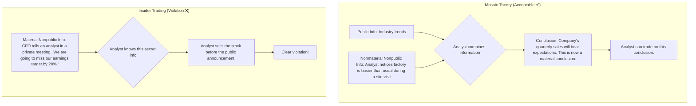

## Standard II: Integrity of Capital Markets

### 🎯 Introduction

Welcome back\! Now that we've covered our personal duties of **Professionalism**, let's zoom out to the entire marketplace. Standard II, **Integrity of Capital Markets**, is all about ensuring a level playing field for everyone. ⚖️

Imagine a card game where one player has seen all the cards in the deck beforehand. Would that be a fair game? Absolutely not\! Similarly, our capital markets must be fair, transparent, and free from manipulation. This standard has two crucial rules that act as the ultimate "fair play" mandate: one against using secret information (insider trading) and another against creating fake market activity (market manipulation).

-----

### Standard II(A): Material Nonpublic Information 🤔

This is one of the most famous and heavily enforced standards. It states that members and candidates who possess **material nonpublic information** that could affect the value of an investment must not act or cause others to act on that information.

Let's break down those key terms:

  * **Material:** Information is **material** if its disclosure would likely have an impact on the price of a security, or if a reasonable investor would want to know the information before making an investment decision.
      * *Example:* A company is about to announce a merger, a surprise earnings miss, a major regulatory approval, or a significant product failure. All of these are clearly **material**.
  * **Nonpublic:** Information is **nonpublic** until it has been made available to the general marketplace.
      * *Example:* An announcement on a major news wire (like Bloomberg or Reuters), a press release, or a public filing with a regulator (like the SEC in the US or SEBI in India) makes the information **public**. A quiet conversation with the CEO in a private elevator is **nonpublic**.

**The Mosaic Theory 🧩**
This is a crucial concept. An analyst can combine **nonmaterial nonpublic information** with **public information** to form a conclusion that is **material**. This is perfectly acceptable and is the essence of good financial analysis. You are piecing together a puzzle from many small, publicly available or insignificant nonpublic clues.

**Firewall Procedures 🔥**
To prevent the misuse of material nonpublic information, firms must establish effective **"firewall"** (or "information barrier") procedures. This means physically and electronically separating departments that routinely receive sensitive information (like investment banking) from departments that make investment decisions (like portfolio management). This prevents confidential information from "leaking" and being misused.

> [\!TIP]
> **CFA Exam Tip ✍️:** The exam will test your ability to distinguish between material and nonmaterial information and between public and nonpublic information. The **Mosaic Theory** is a favorite topic. If the analyst connects the dots themselves using small, insignificant pieces of information, it's good analysis. If an insider *gives* them the conclusion, it's a violation.

-----

### Standard II(B): Market Manipulation 🎣

This standard says you must not engage in practices that distort prices or artificially inflate trading volume with the intent to mislead market participants. In simple terms: **Don't fake it.**

There are two main categories of **market manipulation**:

1.  **Information-Based Manipulation:** Spreading false rumors, "pumping up" a stock with misleading positive information online, or knowingly circulating incorrect news to influence the price.

      * **Global & Local Context 🌍 (Global):** The rise of "meme stocks" like GameStop saw a lot of online chatter. While enthusiastic discussion is fine, intentionally spreading false information to create a buying frenzy (a "pump and dump" scheme) is a clear violation.
      * **Global & Local Context 🌍 (Indian):** In India, SEBI has cracked down on "pump and dump" schemes conducted through SMS tips or WhatsApp groups, where operators first buy a cheap penny stock, spread false positive news to attract retail investors, and then sell their shares at the inflated price, causing the price to crash.

2.  **Transaction-Based Manipulation:** This involves trades that deceive the market by giving the impression of activity or price movement that isn't real.

      * **Securing a Dominant Position:** Cornering the market in a stock, bond, or commodity to dictate the price.
      * **Marking the Close:** Executing trades at or near the end of the trading day to influence the closing price of a security. This can affect fund valuations or the settlement of derivatives.
      * **Spoofing/Layering:** Placing large orders with no intention of executing them to create a false impression of demand or supply, tricking others into trading.

<!-- tabs:start -->

#### **Theory 🧠**

Imagine a trader wants to sell a large block of shares in Company XYZ without causing the price to drop. They could engage in **"ramping,"** an illegal practice where they start by placing several small buy orders to create the illusion of buying interest, driving the price up slightly. Once other investors are lured in, the manipulator sells their large block at the artificially high price.

#### **Example 🧮**

A classic example of information-based manipulation is the "short and distort" campaign. A trader takes a large short position in a stock (betting its price will fall). They then release a scathing, and often false, research report or start online rumors about the company's impending doom. If the panic causes investors to sell, the price drops, and the manipulator profits from their short position.

<!-- tabs:end -->

> [\!TIP]
> **CFA Exam Tip ✍️:** The key element for a violation of this standard is **intent**. The manipulator must *intend* to mislead the market. Legitimate trading strategies, even if they are large and affect prices, are not a violation if they are based on a genuine belief about the investment's value. The exam will give you clues about the trader's intent.

-----

> [\!IMPORTANT]
>
> ### 🎯 Quick Exam-Day Pointers
>
>   * **Material Nonpublic Info (MNPI):** If it's a secret and it's important, **don't trade on it and don't tell anyone else.** It's that simple.
>   * **Mosaic Theory is OK:** It's your job as an analyst to piece together small, public, or nonmaterial clues. This is skill, not a violation.
>   * **When is info "Public"?** When it's been disseminated to the general market (e.g., press release, major news source). A conversation with a room full of analysts does *not* make it public.
>   * **Manipulation = Intent to Mislead:** The core of a manipulation charge is proving the actor's intent was to deceive others, either by spreading false information or executing deceptive trades.
>   * **Firewalls are Your Friend:** For firms, the best defense against accidental insider trading is a robust information barrier between departments.