## Standard III: Duties to Clients

### 🎯 Introduction

Alright, let's talk about the heart and soul of our profession: our clients. If Standard I was about you (Professionalism) and Standard II was about the market (Integrity), then Standard III is all about **them**. Think of yourself as a fiduciary, a trusted captain of your client's financial ship. 🚢 Your primary mission is to navigate the turbulent waters of the market with their best interests, and only their interests, at heart. This standard isn't just about being honest; it's about being loyal, prudent, fair, and suitable. Let's break down what that means.

-----

### Standard III(A): Loyalty, Prudence, and Care 🤔

This is the cornerstone of the client relationship. It states you have a duty of **loyalty** to your clients and must act with reasonable **care** and exercise prudent **judgment**. In short, **clients come first**. Always.

  * **Loyalty:** Your clients' interests must take priority over your own interests and your employer's interests. If you're considering a trade, you must ask, "Is this genuinely the best decision for my client?"
  * **Prudence:** This means acting with the skill, care, and diligence that a reasonable person in your position would use. It's the "prudent person rule." You're not expected to be perfect, but you are expected to be careful and thorough.
  * **Care:** This is the ongoing duty to manage your client's assets with their goals and risk tolerance in mind.

**Identifying the "Client"**
Who is the actual client? It's not always just one person.

  * If you manage a pension plan, the "client" is the beneficiaries of the plan, not the company that hired you.
  * If you manage a mutual fund, the "client" is the investors in that fund.
  * Your duty is to the ultimate beneficiary of your work.

**"Soft Dollars" or "Soft Commissions" 💵**
This is a key area where loyalty is tested. **Soft dollars** are commission rebates paid by a broker to an investment manager in exchange for the manager directing trades to that broker. These rebates must be used for services that directly benefit the client, such as investment research. They cannot be used to pay for the manager's own operating expenses, like office rent or salaries.

<!-- tabs:start -->

#### **Acceptable vs. Unacceptable Use of Soft Dollars ✅/❌**

| Expense Paid with Soft Dollars | Acceptable? | Why? |
| :--- | :--- | :--- |
| Third-party investment research reports | ✅ | Helps the manager make better investment decisions for the client. |
| Subscriptions to financial newspapers | ✅ | Directly aids in the investment decision-making process. |
| Office furniture or computer hardware | ❌ | This is an operating expense of the manager and does not directly benefit the client. |
| Portfolio accounting software | ✅ | Benefits the client through better tracking and management. |

<!-- tabs:end -->

> [\!TIP]
> **CFA Exam Tip ✍️:** The exam loves questions about loyalty. Always, always, *always* put the client first. If a question gives you a choice between benefiting the client, your firm, or yourself, the answer is **always the client**. Also, be ready for a soft dollar question—remember the "direct client benefit" test.

-----

### Standard III(B): Fair Dealing ⚖️

This standard mandates that you must deal **fairly and objectively** with all clients when providing investment analysis, making investment recommendations, or taking investment action. You can't favor one client over another.

This is especially critical when new information or recommendations are released. You must have a system to ensure all clients get the information at roughly the same time.

It's also crucial when it comes to IPOs and new issues. These are often oversubscribed, and you cannot use them to reward your favorite clients. You must have a fair allocation process.

```mermaid
graph TD
    A[A hot IPO is available] --> B{How to allocate shares?};
    B -- Unfair Method ❌ --> C[Give all shares to the largest or most profitable clients first.];
    B -- Fair Method ✅ --> D[Allocate on a pro-rata basis based on asset size or another predetermined objective system.];
    C --> E[Violation of Fair Dealing!];
    D --> F[No Violation ✅];
```

<!-- tabs:start -->

#### **Global & Local Context 🌍**

  * **Global Example:** A portfolio manager at a large US asset manager decides to sell a holding. They must sell the shares from all client accounts participating in that strategy at the same time and at the same average price. They cannot sell shares from their own personal account or their family's accounts *before* selling for their clients. That would be a violation of both loyalty and fair dealing.
  * **Indian Example:** A wealth manager in India gets a limited allocation of a highly anticipated IPO, like Zomato or Nykaa. They have many clients who want shares. A fair system would be to allocate the shares based on each client's AUM (Assets Under Management) as a percentage of the total client pool's AUM. Simply giving them to the clients who complain the loudest or who are personal friends would be a clear violation.

<!-- tabs:end -->

> [\!TIP]
> **CFA Exam Tip ✍️:** "Fairly" does not mean "equally." A large client will naturally get a larger block of shares in an IPO allocation than a small client under a pro-rata system. The key is that the *process* is fair and systematic, not that the outcomes are identical for everyone.

-----

### Standard III(C): Suitability 🎯

When you are in an advisory relationship with a client, you have a duty to ensure your investment recommendations are **suitable** for their specific situation. This means you must:

1.  **Know Your Client:** Make a reasonable inquiry into the client's investment experience, risk and return objectives, and financial constraints. This is often done by creating an **Investment Policy Statement (IPS)**.
2.  **Judge Suitability:** Ensure that any investment recommendation is consistent with the client's profile. You wouldn't recommend speculative small-cap stocks to a risk-averse retiree who needs steady income.
3.  **Judge Suitability in a Portfolio Context:** Recommendations must make sense within the context of the client's *total portfolio*, not just as a standalone investment.

**What if a client wants to make an unsuitable trade?**
If a client insists on buying a stock that you believe is unsuitable for them, you must not make the trade without first explaining to the client why you think it's a bad idea. If the trade would have a material impact on the client's entire portfolio, you may need to reconsider the advisory relationship.

<!-- tabs:start -->

#### **Theory 🧠: The IPS**

The **Investment Policy Statement (IPS)** is your roadmap for managing a client's portfolio. It's a formal document that outlines their:

  * **Objectives:** Return requirements and risk tolerance.
  * **Constraints:** Liquidity needs, time horizon, tax situation, legal/regulatory issues, and any unique circumstances.

This document is the foundation of the suitability standard.

#### **Example 🧮**

  * **Client:** A 30-year-old software engineer in Bangalore with a high salary, long time horizon, and high-risk tolerance.
  * **Suitable:** A portfolio with a high allocation to global and Indian equities, including some venture capital or private equity.
  * **Unsuitable:** A portfolio consisting mainly of government bonds and fixed deposits.

<!-- tabs:end -->

> [\!TIP]
>
>   * **Client:** A 70-year-old retiree in Mumbai living off their investments.
>   * **Suitable:** A portfolio focused on capital preservation and income generation, like high-quality bonds, dividend-paying stocks, and annuity products.
>   * **Unsuitable:** A portfolio heavily weighted towards volatile tech startups.
>
> -----

> [\!TIP]
> **CFA Exam Tip ✍️:** For the exam, suitability is all about matching the client's IPS to the investment. You must consider the portfolio as a whole. A single risky investment might be suitable for an aggressive portfolio but completely unsuitable for a conservative one. Also, remember that this standard only applies when you have an **advisory relationship** with the client.

-----

### Standard III(D): Performance Presentation 📊

When you show clients or prospects how well you've done, you must ensure the performance information is **fair, accurate, and complete**. You can't cherry-pick your best results to mislead people.

Key principles include:

  * Don't misstate performance or promise future returns.
  * Provide a complete picture, not just your best-performing funds.
  * The **GIPS® standards (Global Investment Performance Standards)** are a set of voluntary ethical principles that firms can adopt to ensure their performance presentation is fair and comparable. While not required by the Code, complying with GIPS is strongly encouraged.

> [\!TIP]
> **CFA Exam Tip ✍️:** The key takeaway is "fair, accurate, and complete." Any action that hides poor performance or inflates good performance is a violation. For example, showing performance for only a select, favorable time period is a misrepresentation.

-----

### Standard III(E): Preservation of Confidentiality 🤫

You must keep information about current, former, and prospective clients **confidential** unless:

1.  The information concerns illegal activities on the part of the client.
2.  Disclosure is required by law.
3.  The client or prospective client permits disclosure of the information.

Think of it like doctor-patient confidentiality. What your client tells you, stays with you. This duty of confidentiality even extends to *former* clients.

<!-- tabs:start -->

#### **When to Disclose vs. When to Keep Quiet**

| Scenario | Action | Why? |
| :--- | :--- | :--- |
| A client tells you they are committing tax fraud. | Disclose to authorities (if required by law). | The information concerns illegal activities. Client confidentiality does not protect criminals. |
| A prospective client shares their financial statements with you. | Keep confidential. | This is sensitive information. You must protect it even if they don't become a client. |
| A regulator requests trading records for a client. | Disclose. | Disclosure is required by law. |
| A former client's new advisor calls you for information. | Do not disclose without the former client's permission. | Your duty of confidentiality survives the end of the client relationship. |

<!-- tabs:end -->

> [\!TIP]
> **CFA Exam Tip ✍️:** The exceptions to this rule are frequently tested. Remember the three conditions: **illegal acts, required by law, or client permission.** In the absence of one of these, you must always maintain confidentiality.

-----

> [\!IMPORTANT]
>
> ### 🎯 Quick Exam-Day Pointers
>
>   * **Client First, Firm Second, Me Third:** This is the hierarchy of loyalty. Always.
>   * **Fair Dealing ≠ Equal Dealing:** The *process* of allocating trades and IPOs must be fair, but the outcomes will vary by client size.
>   * **IPS is Your Bible:** For suitability questions, the Investment Policy Statement dictates every decision. Match the investment to the IPS.
>   * **Performance Must Be Honest:** Don't cherry-pick data. Present a "fair, accurate, and complete" record.
>   * **Keep Secrets Secret:** Client information is confidential unless you're dealing with illegal acts, the law requires disclosure, or the client says it's okay. This applies to current, former, and potential clients.