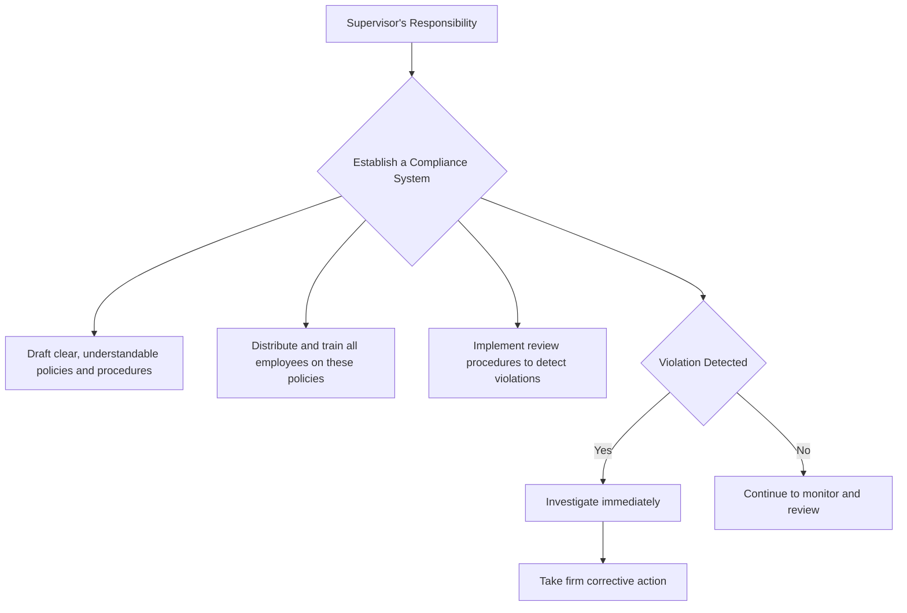

Of course. It's time to shift our focus from our clients to our employers. This standard is all about navigating your professional responsibilities within your firm.

Here is the summary for the next standard.

-----

## Standard IV: Duties to Employers

### 🎯 Introduction

So far, we've established that the client is king. But what about the company that signs your paycheck? Standard IV, **Duties to Employers**, addresses this crucial relationship. Think of it as a balancing act. You are a trusted employee, and you owe your employer your loyalty and hard work. 🏢 At the same time, your duty to the client and the market remains supreme. This standard provides the rules of engagement for how to be a good employee without ever compromising your ethical obligations to your clients or the integrity of capital markets. Let's explore the three key duties you have to your employer.

-----

### Standard IV(A): Loyalty 🤔

This standard says that in matters related to your employment, you must act for the benefit of your employer and not deprive your employer of the advantage of your skills and abilities, divulge confidential information, or otherwise cause harm to your employer.

Simply put: while you're on the clock, work for your employer. Don't engage in any activities that would create a conflict of interest with their business.

**The Most Tested Area: Preparing to Leave Your Firm**
This is where it gets tricky. You are allowed to prepare for a new job or to start your own firm, but there are strict lines you cannot cross *before* you resign.

<!-- tabs:start -->

#### **What's Allowed vs. Not Allowed (Before Resigning) ✅/❌**

| Action | Permitted? | Why? |
| :--- | :--- | :--- |
| Making arrangements to start a new firm (e.g., registering the company name, leasing office space). | ✅ | These are preparatory steps and do not directly compete with your employer's business *yet*. |
| Contacting clients to solicit their business for your new firm. | ❌ | This is direct competition and a breach of loyalty. You can only do this *after* you have left. |
| Printing your employer's client list from the company CRM. | ❌ | This is **theft** of employer property. Client lists are confidential and belong to the firm. |
| Using your own memory to recall who your former clients were. | ✅ | Your knowledge and experience are your own. You can use your memory to rebuild a client list after you leave. |
| Taking research reports you wrote with you. | ❌ | The work you produce for your employer belongs to them. |

<!-- tabs:end -->

**Whistleblowing 🌬️**
Your duty of loyalty to your employer does not mean you must sit by and watch them engage in illegal or unethical activities. In fact, your duty to protect the integrity of the capital markets and your clients is higher. Protecting your employer from the legal and reputational damage of such activities *is* an act of loyalty.

> [\!TIP]
> **CFA Exam Tip ✍️:** The exam questions on this topic are almost always about an employee leaving a firm. The key is the timing. **Before leaving:** prepare, but do not compete or take property. **After leaving:** you are free to compete fairly, using your own knowledge and publicly available information. Memorizing the client list is not a violation; taking the physical or electronic list is.

-----

### Standard IV(B): Additional Compensation Arrangements ⚖️

This standard is very direct: you must not accept any gifts, benefits, compensation, or consideration that competes with, or might reasonably be expected to create a conflict of interest with, your employer's interest unless you obtain **written consent** from **all parties involved**.

Think of it this way: your employer pays you to do a job. If someone else wants to pay you for that same job, your employer needs to know about it and approve it in writing.

This is different from Standard I(B) - Independence and Objectivity:

  * **Standard I(B)** deals with gifts from third parties trying to influence your future behavior (e.g., a company you cover sends you on a lavish trip).
  * **Standard IV(B)** deals with compensation for services rendered that are outside your normal employment agreement (e.g., a client pays you a bonus directly).

<!-- tabs:start -->

#### **Global & Local Context 🌍**

  * **Global Example:** A portfolio manager is invited to serve on the board of directors of a company. This position comes with a fee. Before accepting, the manager **must** get written permission from her employer, as serving on a board could create conflicts of interest and takes up time that would otherwise be dedicated to her employer.
  * **Indian Example:** An equity analyst who covers the Indian IT sector is asked by a university to teach a weekend course on financial modeling for a fee. Even though this is on his own time, it relates to his professional expertise. He must disclose this arrangement to his employer in writing and get their consent before proceeding. The employer needs to ensure it doesn't interfere with his primary job or create any conflicts.

<!-- tabs:end -->

> [\!TIP]
> **CFA Exam Tip ✍️:** The key phrase here is **"written consent."** Verbal notification is not enough. If you see a scenario where an employee accepts money or a benefit from a third party without getting prior written approval from their employer, it's a clear violation of Standard IV(B).

-----

### Standard IV(C): Responsibilities of Supervisors 🎯

With great power comes great responsibility. This standard says that if you are in a supervisory role, you must make reasonable efforts to ensure that anyone subject to your supervision or authority complies with applicable laws, rules, regulations, and the Code and Standards.

You don't have to be a mind reader, but you can't be negligent either. You must take steps to **prevent and detect** violations. This means having an effective compliance system.

An adequate compliance system should include:

  * **Clear Policies:** The rules should be written down and easy to understand.
  * **Education & Training:** Employees should be regularly trained on the policies.
  * **Enforcement:** When a violation occurs, the supervisor must investigate promptly and take firm disciplinary action.

<!-- end list -->

What if a supervisor delegates a task? They are still ultimately responsible. You can delegate the work, but not the responsibility.

> [\!TIP]
> **CFA Exam Tip ✍️:** A supervisor is not automatically guilty just because someone on their team commits a violation. The exam question will focus on whether the supervisor made **"reasonable efforts"** to prevent such a violation from occurring. If they have a good compliance system in place and an employee goes to great lengths to hide their wrongdoing, the supervisor may not be in violation. If the system is weak or they ignored red flags, they are in violation.

-----

> [\!IMPORTANT]
>
> ### 🎯 Quick Exam-Day Pointers
>
>   * **Leaving a Job:** Remember the bright line. **Prepare, don't compete.** Don't take any property—client lists, research, or models. Your brain is the only thing you're allowed to take with you.
>   * **Side Gigs Need Permission:** If you're getting paid by anyone other than your employer for your professional services, you need **written consent** first. Verbal approval is not sufficient.
>   * **Supervisors Must Supervise:** A manager's job is to build a system to **prevent and detect** violations. If a violation occurs, they must investigate and act. Ignoring a problem is a violation in itself.
>   * **Client vs. Employer:** If there is a conflict between your duty to your client and your duty to your employer, your duty to the client always comes first (as long as it's legal).