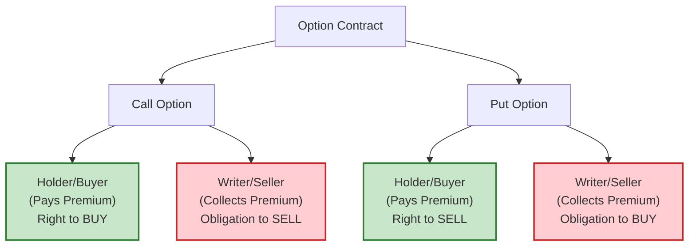
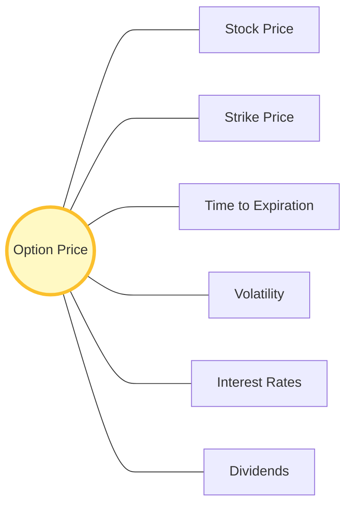

Here is the summary of Chapter 1, tailored to the requested format and persona.

-----

## Chapter 1: Definitions - Unlocking the Language of Options 🗝️

### 🎯 Introduction

Welcome, aspiring Option Samurai\! 🥋 Before we can start slicing through the market with advanced strategies, we must master the basics. Think of this chapter as your dojo, where you learn the fundamental stances and moves.

Options trading has its own unique vocabulary. At first, it might sound like a foreign language, but don't worry\! We will break down these terms into simple, bite-sized pieces. Understanding the difference between a "Call" and a "Put," or "Intrinsic Value" and "Time Value," is the foundation upon which your trading empire will be built. Let's sharpen our swords and dive in\! ⚔️

-----

### Part 1: The Core Concepts (Elementary Definitions)

An **Option** is simply a contract. It gives you the **right** (but not the obligation) to buy or sell a stock at a specific price for a limited time.

#### 1.1 The Two Main Weapons: Calls and Puts

  * **Call Option 📞:** Gives the owner the right to **BUY** the stock. Think of "Calling" the stock away from someone. You want the stock to go **UP**.
  * **Put Option 📉:** Gives the owner the right to **SELL** the stock. Think of "Putting" the stock to someone else. You want the stock to go **DOWN**.

**💡 Samurai Mnemonic: Call vs. Put**

  * **Call Up:** You buy a **Call** when you think the stock will go **Up**. (Pick up the phone to Call).
  * **Put Down:** You buy a **Put** when you think the stock will go **Down**. (Put the phone Down).

#### 1.2 The Players

Every contract has two sides. It's crucial to know which side you are on\!

  * **The Holder (Buyer):** The person who buys the option. They pay the premium and have the **right** to exercise.
  * **The Writer (Seller):** The person who sells the option. They collect the premium but take on the **obligation** to fulfill the contract if asked.

<!-- end list -->

-----

### Part 2: Anatomy of an Option & Standardization

To trade efficiently, options are standardized. Here are the key specs:

1.  **Underlying Security:** The stock being traded (e.g., IBM, GE).
2.  **Expiration Date:** The day the contract dies. Options are "wasting assets"—they don't last forever\!
      * *Standard Cycle:* Options expire on the Saturday following the 3rd Friday of the month.
3.  **Striking Price (Exercise Price):** The fixed price at which you can buy or sell the stock.
      * Strikes are usually spaced 5 points apart (e.g., 50, 55, 60) for higher-priced stocks, or 2.5 points for cheaper stocks.

**⚠️ Important Note on Adjustments**
Stock splits can change your option\!

  * **2-for-1 Split:** You get *twice* as many option contracts, and the strike price is cut in *half*.
  * **Cash Dividends:** These do **NOT** affect the terms of the option. The strike price stays the same.

-----

### Part 3: The Price of an Option (Valuation) 💰

Why does an option cost what it costs? The price (Premium) is made of two parts:

`Option Price = Intrinsic Value + Time Value`

#### 3.1 Intrinsic Value: The "Real" Value

This is the profit you would make if you exercised the option *right now*.

  * **Call Intrinsic Value:** Stock Price - Strike Price (if positive).
  * **Put Intrinsic Value:** Strike Price - Stock Price (if positive).

*If an option has Intrinsic Value, we say it is **In-the-Money (ITM)**.*
*If it has NO Intrinsic Value, it is **Out-of-the-Money (OTM)**.*

#### 3.2 Time Value: The "Hope" Value

This is the extra amount people pay hoping the stock will move in their favor before expiration.

  * **Decay:** Time value "decays" (disappears) as expiration gets closer. It decays fastest in the last few weeks\! ⏳

#### 3.3 The 6 Factors Influencing Price

What moves the needle on option prices?

1.  **Stock Price:** The main driver.
2.  **Strike Price:** The target.
3.  **Time Remaining:** More time = Higher price.
4.  **Volatility:** The "Wild Card." More volatile stocks = Higher option prices (more chance to hit a home run\!).
5.  **Interest Rates:** Small effect, but higher rates generally raise Call prices.
6.  **Dividends:** Dividends tend to *lower* Call prices.

<!-- end list -->

-----

### Part 4: Trading Mechanics & Symbology

#### 4.1 Reading the Code (Symbology)

Historically, options used a code (Root + Month Code + Strike Code).

  * **Month Codes:**
      * **Calls:** A through L (Jan = A, Feb = B... Dec = L).
      * **Puts:** M through X (Jan = M, Feb = N... Dec = X).
  * **Example:** `IBM FJ`
      * **IBM:** Underlying Stock.
      * **F:** June (Call).
      * **J:** Strike Price (e.g., 50).

*(Note: While modern systems often spell it out, knowing the roots helps you understand the "language" of the floor).*

#### 4.2 Order Types

Just like stocks, you can use different orders:

  * **Market Order:** Buy/Sell *now* at the best price.
  * **Limit Order:** Buy/Sell only at a *specific price* (or better).
  * **Stop Order:** Trigger a trade once a specific price is hit.

#### 4.3 Exercise & Assignment

  * **Exercise:** You (the holder) tell your broker to use your right to buy/sell the stock. The broker tells the OCC (Options Clearing Corporation).
  * **Assignment:** The OCC randomly picks a brokerage firm, which then picks a client (you, the writer) to fulfill the obligation.
  * **Automatic Exercise:** If you are In-the-Money by a certain amount at expiration, the OCC exercises for you automatically so you don't lose profit\!

-----

### Summary: The Samurai's Checklist ✅

  * **Calls vs. Puts:** Calls for Bullish 🐮, Puts for Bearish 🐻.
  * **Rights vs. Obligations:** Buyers have rights; Sellers have obligations.
  * **Price Components:** Premium = Intrinsic Value + Time Value.
  * **Time Decay:** Options are wasting assets; time works against the buyer and for the seller.
  * **Standardization:** Strikes and Expirations are fixed to make trading easier (liquidity).
  * **Liquidity:** Look for high "Open Interest" to ensure you can enter/exit trades easily.

### 🎯 Quick Samurai Pointers

  * **Parity:** When an option is trading exactly at its Intrinsic Value.
  * **LEAPS:** Long-term options (expiring in years, not months). Great for long-term strategies\!
  * **Wasting Asset:** Never forget that an option is like an ice cube; it melts every day it is held\! 🧊
  * **The "Delta":** A sneak peek at advanced concepts—how much the option moves for every $1 move in the stock.

