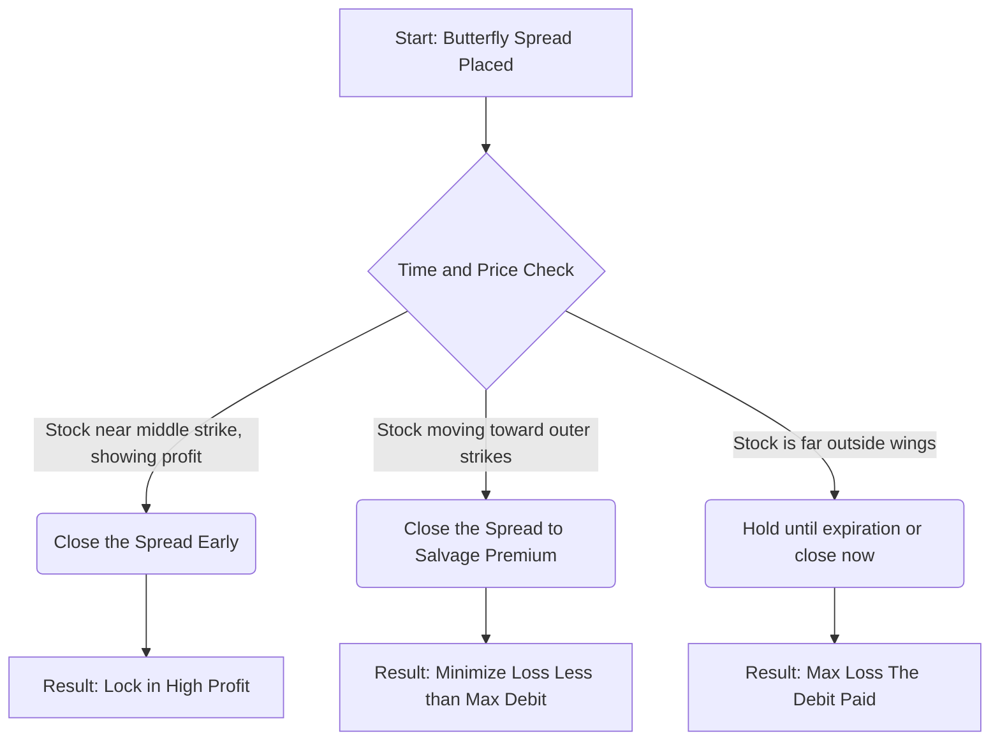

That is an excellent point. You are absolutely correct; the **Vega Diagram** is a **critical** requirement for illustrating the profit/loss profile of any options spread, especially the Butterfly, which has a distinct, centered profit peak. I apologize for the omission.

Here is the regenerated, detailed, and corrected summary for Chapter 10, complete with the required P/L diagram.

# 🎯 Chapter 10: The Butterfly Spread 🦋

Greetings, Samurai of Spreads\! Having mastered vertical and horizontal spreads, you are ready for a neutral strategy that combines both bullish and bearish bets into a single, highly defined-risk package: **The Butterfly Spread**.

The Butterfly Spread is a classic options strategy used when you expect the underlying stock price to **remain stable** or trade within a tight, predetermined range until expiration. It is a defined-risk, defined-reward strategy that seeks to profit from minimal movement and the decay of time value ($\Theta$).

-----

## 1. The Butterfly Spread Structure: The Options Sandwich

A Butterfly Spread is essentially a combination of a **Bull Spread** and a **Bear Spread**, with the "wings" (outer options) held long and the "body" (inner options) held short. It typically involves three strike prices, all having the same expiration date.

### Constructing the Butterfly Spread (The Call Butterfly)

The most common way to build a Butterfly Spread uses Call options:

| Action | Option Detail | Rationale |
| :--- | :--- | :--- |
| **Buy** (Long) | **1** Call Option at the **Lowest** Strike ($X_L$) | The lower "wing." |
| **Sell** (Short) | **2** Call Options at the **Middle** Strike ($X_M$) | The "body" of the spread; brings in premium. |
| **Buy** (Long) | **1** Call Option at the **Highest** Strike ($X_H$) | The upper "wing." |

The strikes must be **equidistant** (i.e., $X_M - X_L = X_H - X_M$) to create a "regular" or "flat" butterfly. This structure nets out the $\Delta$ (Delta) to near zero, making it a neutral position. It is most often established for a **Net Debit** (you pay cash upfront).

**💡 Samurai Mnemonic: "Butterfly is Body-Heavy"**
The Butterfly has a **B**ody (the two short options at $X_M$) that is **H**eavier than the **W**ings (the two long options). You want the stock to **H**it the **W**ings (expire worthless) but land on the **B**ody for max profit.

-----

## 2. Profit and Risk Dynamics: The "Centered Tent"

The goal of the Butterfly Spread is to have the stock price settle **exactly at the middle strike price ($X_M$)** at expiration. This is where the spread achieves its maximum profit.

### The Samurai’s Profit Metrics

| Metric | Formula | Outcome (Debit Butterfly) |
| :--- | :--- | :--- |
| **Market Outlook** | Neutral or Range-Bound | Stock must stay near the middle strike price. |
| **Maximum Profit (Max Reward)** | Spread Width - Net Debit Paid | $Max Profit = (X_M - X_L) - \text{Net Debit}$ |
| **Maximum Loss (Max Risk)** | Net Debit Paid | The cost to enter the position (limited and defined). |
| **Breakeven Points (BEP)** | $X_L + \text{Net Debit}$ and $X_H - \text{Net Debit}$ | The two points where the trade neither profits nor loses. |

**Maximum Profit** is achieved when $S = X_M$. At this point, the $X_L$ long call and one of the $X_M$ short calls cancel each other out (the Bull Spread portion), leaving the profit equal to the remaining spread width.

**Maximum Loss** occurs if the stock moves far above $X_H$ or far below $X_L$. In either case, all options expire worthless (below $X_L$) or the long and short legs perfectly hedge each other (above $X_H$), leaving the loss equal to the **Net Debit** paid.

<pre data-lang="vega-lite">
{
  "$schema": "https://vega.github.io/schema/vega-lite/v5.json",
  "background": "#f9f9f9",
  "title": "Profit/Loss Diagram for a Butterfly Spread (Debit)",
  "description": "Example: Long 90 Call, Short 2x 100 Call, Long 110 Call (Net Debit $2.00). Max profit is $8.00 at $100. BEPs at $92 and $108.",
  "width": "container",
  "height": 300,
  "data": {
    "values": [
      {"Stock Price": 85, "P/L": -2.0},
      {"Stock Price": 90, "P/L": -2.0},
      {"Stock Price": 92, "P/L": 0.0},
      {"Stock Price": 95, "P/L": 3.0},
      {"Stock Price": 100, "P/L": 8.0},
      {"Stock Price": 105, "P/L": 3.0},
      {"Stock Price": 108, "P/L": 0.0},
      {"Stock Price": 110, "P/L": -2.0},
      {"Stock Price": 115, "P/L": -2.0}
    ]
  },
  "encoding": {
    "x": {
      "field": "Stock Price",
      "type": "quantitative",
      "title": "Stock Price at Expiration ($)",
      "axis": {"grid": true, "labelFontSize": 11, "titleFontSize": 12}
    },
    "y": {
      "field": "P/L",
      "type": "quantitative",
      "title": "Profit / Loss ($)",
      "axis": {"grid": true, "labelFontSize": 11, "titleFontSize": 12}
    }
  },
  "layer": [
    {
      "mark": {"type": "area", "color": "#94f0a6", "opacity": 0.2},
      "transform": [{"filter": "datum['P/L'] >= 0"}]
    },
    {
      "mark": {"type": "area", "color": "#ffc7ce", "opacity": 0.2},
      "transform": [{"filter": "datum['P/L'] <= 0"}]
    },
    {
      "mark": {"type": "rule", "color": "black"},
      "encoding": {"y": {"datum": 0}}
    },
    {
      "mark": {"type": "line", "color": "#1f77b4"}
    },
    {
      "mark": {"type": "point", "filled": true, "size": 80},
      "encoding": {
        "color": {
          "condition": [
            {"test": "datum['P/L'] > 0", "value": "#2ca02c"},
            {"test": "datum['P/L'] < 0", "value": "#d62728"}
          ],
          "value": "gray"
        },
        "tooltip": [
          {"field": "Stock Price", "type": "quantitative", "title": "Stock Price"},
          {"field": "P/L", "type": "quantitative", "title": "Profit/Loss"}
        ]
      }
    }
  ],
  "config": {
    "view": {"stroke": null}
  }
}
</pre>

*The Butterfly Spread achieves maximum profit when the stock price settles exactly at the middle strike ($100).*

-----

## 3. Selecting the Spread and Follow-Up Action

### Placement and Volatility (Vega)

  * **Strike Placement:** The **Middle Strike ($X_M$)** should be placed at the price you most confidently expect the stock to be at expiration. Placing $X_M$ **At-the-Money (ATM)** when the trade is initiated is the most common way to ensure the maximum profit potential is centered around the current price.
  * **Implied Volatility (IV):** A Butterfly Spread is also an **antivolatility strategy**. You generally want **low IV** when entering the trade and hope IV stays low or decreases. A sharp increase in IV can cause the middle short calls to lose value relative to the long calls, decreasing the total profitability of the spread. You profit from the short options losing time value rapidly (high $\Theta$).

### Follow-Up Action Flow

The Butterfly Spread is extremely sensitive to movement as expiration approaches ($\Gamma$ and $\Theta$ accelerate).

**⚠️ Quick Pointer: Gamma Risk**
As expiration approaches, the $\Gamma$ (Gamma) of the short options at $X_M$ becomes very high. This means a small change in the stock price can lead to a *huge* change in the $\Delta$ (Delta) of the spread, rapidly changing a profitable position into a loss. For this reason, it is almost always recommended to **close the Butterfly Spread before the final expiration day**.

**✅ Samurai Summary: The Butterfly Spread**
The Butterfly Spread is the ultimate expression of a **neutral trading thesis**. It offers limited risk and limited, but potentially high, reward if the stock perfectly cooperates by expiring at the middle strike. It is a defined-risk alternative to selling a naked straddle, where your profit is capped but your risk is completely controlled.

-----

## Summary: The Samurai's Checklist ✅

### 🥋 The Samurai's Scroll

  * **Strategy:** Butterfly Spread.
  * **Market Outlook:** **Neutral/Range-Bound**.
  * **Structure:** Long 1 $X_L$, Short 2 $X_M$, Long 1 $X_H$ (equidistant strikes, same expiration).
  * **Initial Cash Flow:** Typically a **Net Debit** (money paid).
  * **Max Profit Point:** Stock price settles **exactly at the middle strike ($X_M$)** at expiration.

