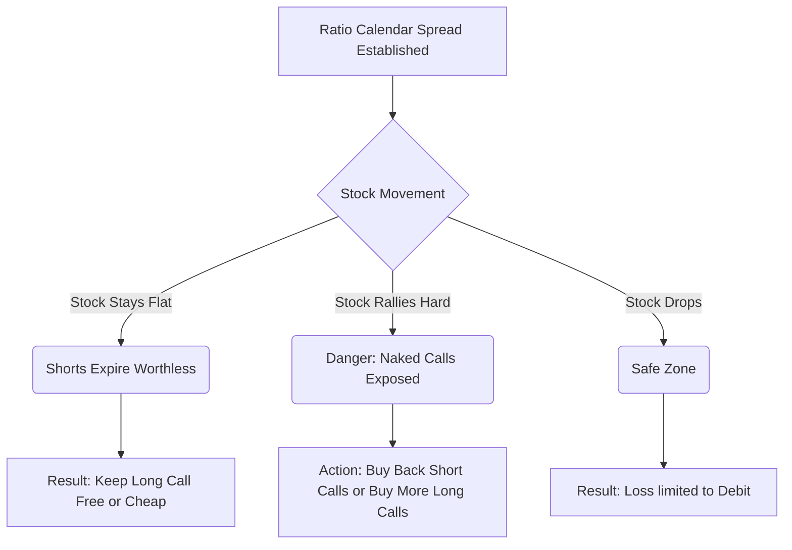

Here is the detailed summary for **Chapter 12**, following your preferred structure and including the necessary visual aids.

# 🎯 Chapter 12: Combining Calendar and Ratio Spreads ⏳⚖️

Welcome, Master Strategist. You have learned to manipulate **Time** (Calendar Spreads) and **Numbers** (Ratio Spreads). Now, we fuse these two powerful concepts.

Chapter 12 introduces the **Ratio Calendar Spread**. This strategy is designed for the trader who wants to profit from the rapid time decay of near-term options while maintaining a longer-term bullish position, but is willing to take on some risk to finance the trade.

-----

## 1. The Ratio Calendar Spread: The Concept

In a standard Calendar Spread, you Buy 1 Long-Term and Sell 1 Short-Term (1:1). In a **Ratio Calendar Spread**, you sell **more** short-term options than you buy long-term options.

### The Setup (The "Variable Write" with Options)

This is essentially a **Variable Ratio Write** (see Chapter 6), but instead of using stock as collateral, you use a long-term Call option.

| Action | Quantity | Option | Rationale |
| :--- | :--- | :--- | :--- |
| **Buy** (Long) | 1 | **Long-Term** Call (Distante) | Acts as the collateral; replaces owning the stock. |
| **Sell** (Short) | 2 (or more) | **Short-Term** Call (Near) | Generates high premium income to pay for the long call. |

**The Goal:** You want the stock to remain near the strike price until the near-term options expire. If they expire worthless, you pocket the premium and still own the Long-Term Call (now potentially for "free" or at a massive discount).

### Risk vs. Reward Profile

  * **Upside Risk:** Because you are short *more* options than you are long (e.g., Short 2, Long 1), you have **unlimited risk** if the stock rockets upward. The Long Call covers one Short Call; the second Short Call is "naked."
  * **Downside Risk:** Limited to the initial debit paid (if any). If established for a credit, you have no downside risk.

**💡 Samurai Mnemonic: "The Free Ride Trap"**
This strategy tries to buy a long-term option for free (by selling extra short-term ones). If it works, you get a "Free Ride" on the long option later. If the stock rallies too fast, it's a "Trap" (naked call risk).

-----

## 2. Profit Dynamics and The Diagram

The profit curve of a Ratio Calendar Spread at the **near-term expiration** looks like a steep mountain.

1.  **If Stock = Strike Price:** Max Profit. The 2 short calls expire worthless. You own the Long Call (which still has significant time value).
2.  **If Stock Crashes:** You lose your debit (or keep your credit).
3.  **If Stock Rallies:** You enter the danger zone. The profit turns into a loss as the naked short calls gain value faster than your single long call can compensate.

<pre data-lang="vega-lite">
{
  "$schema": "https://vega.github.io/schema/vega-lite/v5.json",
  "background": "#f9f9f9",
  "title": "P/L Diagram: Ratio Calendar Spread (at Near-Term Expiration)",
  "description": "Long 1 Jan 50 Call ($6), Short 2 Oct 50 Calls ($2.50 ea). Net Debit $1.00.",
  "width": "container",
  "height": 300,
  "data": {
    "values": [
      {"Stock Price": 40, "P/L": -1.0},
      {"Stock Price": 45, "P/L": -0.5},
      {"Stock Price": 48, "P/L": 1.0},
      {"Stock Price": 50, "P/L": 4.5},
      {"Stock Price": 52, "P/L": 1.0},
      {"Stock Price": 55, "P/L": -3.0},
      {"Stock Price": 60, "P/L": -9.0}
    ]
  },
  "encoding": {
    "x": {
      "field": "Stock Price",
      "type": "quantitative",
      "title": "Stock Price at Near-Term Expiration ($)",
      "axis": {"grid": true, "labelFontSize": 11, "titleFontSize": 12}
    },
    "y": {
      "field": "P/L",
      "type": "quantitative",
      "title": "Profit / Loss ($100s)",
      "axis": {"grid": true, "labelFontSize": 11, "titleFontSize": 12}
    }
  },
  "layer": [
    {
      "mark": {"type": "area", "color": "#94f0a6", "opacity": 0.2},
      "transform": [{"filter": "datum['P/L'] >= 0"}]
    },
    {
      "mark": {"type": "area", "color": "#ffc7ce", "opacity": 0.2},
      "transform": [{"filter": "datum['P/L'] <= 0"}]
    },
    {
      "mark": {"type": "rule", "color": "black"},
      "encoding": {"y": {"datum": 0}}
    },
    {
      "mark": {"type": "line", "color": "#7B1FA2"}
    },
    {
      "mark": {"type": "point", "filled": true, "size": 80},
      "encoding": {
        "color": {
          "condition": [
            {"test": "datum['P/L'] > 0", "value": "#2ca02c"},
            {"test": "datum['P/L'] < 0", "value": "#d62728"}
          ],
          "value": "gray"
        },
        "tooltip": [
          {"field": "Stock Price", "type": "quantitative", "title": "Stock Price"},
          {"field": "P/L", "type": "quantitative", "title": "Profit/Loss ($100s)"}
        ]
      }
    },
    {
      "mark": {"type": "text", "align": "left", "dx": 5, "dy": -5, "text": "Peak Profit (Shorts Expire)"},
      "encoding": {"x": {"datum": 50}, "y": {"datum": 4.5}}
    },
    {
      "mark": {"type": "text", "align": "left", "dx": 5, "dy": 5, "text": "Danger Zone - Unlimited Risk"},
      "encoding": {"x": {"datum": 55}, "y": {"datum": -3}}
    }
  ],
  "config": {
    "view": {"stroke": null}
  }
}
</pre>

*The Ratio Calendar Spread shows a steep profit peak at the strike price ($50) when short-term options expire, with unlimited risk if the stock rallies beyond $55.*

-----

## 3. Delta-Neutral Calendar Spreads

A sophisticated variation involves constructing the spread to be **Delta Neutral**.

In a standard 1:1 Calendar Spread, the position is usually neutral if the stock is at the strike price. However, in a **Ratio Calendar**, the extra short calls make the position **Net Short Delta** (bearish bias).

To fix this, the strategist adjusts the ratio to achieve neutrality.

### The Adjustment Logic

Since near-term options have a higher Gamma (rate of change) than long-term options:

  * **At the Money:** The Delta of the near-term is roughly 0.50, and the long-term is roughly 0.50. A 1:1 spread is neutral.
  * **Out of the Money:** The near-term delta drops faster. You might need to sell *more* near-term options to match the total delta of the long-term option.

**Objective:** Create a position that is immune to small price moves and profits purely from the **Time Decay differential** (Theta) between the two expiration months.

### Follow-Up Action

**⚠️ Warning: The Volatility Crunch**
If **Implied Volatility (IV)** collapses, this trade suffers. You are Long Vega (long the back-month option). If IV drops, your long option loses value. Ideally, you want IV to rise (pumping the long option) or stay stable while the short options decay.

-----

## Summary: The Samurai's Checklist ✅

### 🥋 The Samurai's Scroll

  * **Strategy:** Ratio Calendar Spread.
  * **Structure:** Long 1 Distant Call / Short >1 Near-Term Call (Same Strike).
  * **Market Outlook:** **Neutral**. You want the stock to sit exactly at the strike price until the near-term expiration.
  * **Key Benefit:** Generates income to lower the cost of the long-term hold.
  * **Key Risk:** **Unlimited Upside**. If the stock moons, the extra short calls will destroy the account unless adjusted quickly.
  * **Best Environment:** Low volatility (cheap to buy the long) that is expected to rise, or simply stable price action.

