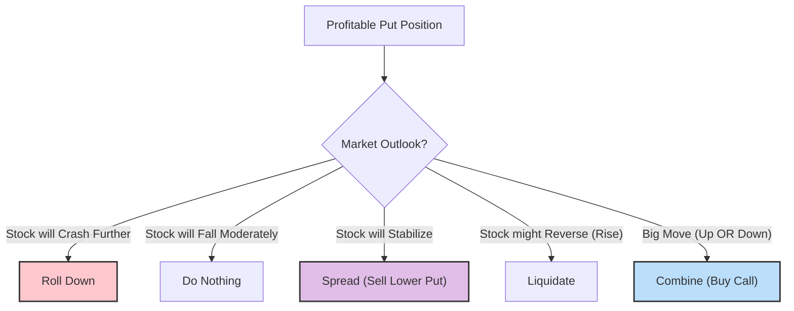

# 🎯 Chapter 16: Put Option Buying 📉

Welcome, Strategist. In the previous chapter, we forged the shield (Put Basics). Now, we learn to wield it as a weapon.

**Put Option Buying** is the aggressive bear’s alternative to short selling stock. It offers the explosive power of leverage with the safety net of limited risk. This chapter explores how to select the right put, when to use it instead of shorting stock, and—crucially—how to manage the position once you have a profit.

-----

## 1. Put Buying vs. Short Selling

When you expect a stock to decline, you have two primary weapons: Shorting the Stock or Buying a Put. While both profit from a fall, their risk profiles are dramatically different.

### The Tale of Two Bears

Imagine **XYZ Stock is at 50**.

  * **Short Seller:** Sells 100 shares at $50. Margin required: \~$2,500.
  * **Put Buyer:** Buys one July 50 Put for $5. Cost: $500.

| Feature | Put Buying | Short Selling Stock |
| :--- | :--- | :--- |
| **Risk** | **Limited** (Cost of Option) | **Unlimited** (Stock can rise indefinitely) |
| **Leverage** | High (Percentage gains are massive) | Moderate (2:1 margin limits leverage) |
| **Time Factor** | **Negative** (Time decay hurts you) | Neutral (Time is irrelevant) |
| **Dividends** | **No Obligation** | **Must Pay Dividends** to the lender |
| **Profit Potential** | High (limited by stock hitting 0) | High (limited by stock hitting 0) |

**💡 Samurai Mnemonic: "The Put Protector"**
Think of a Put as a **Paid Protector**. You pay a fee (premium) upfront. If the fight goes badly (stock rises), the Protector takes the hit, and you walk away losing only the fee. If you Short Sell, *you* are in the fight yourself, and there is no limit to how badly you can get hurt.

### Profit Profile: Long Put (Aggressive)

The following chart illustrates the leverage of a Long Put. Note the "hockey stick" shape where losses are capped at the premium paid ($5), but profits expand rapidly as the stock falls.

<pre data-lang="vega-lite">
{
  "$schema": "https://vega.github.io/schema/vega-lite/v5.json",
  "background": "#f9f9f9",
  "title": "P/L Diagram: Long Put (Strike 50, Price 5)",
  "description": "Profit and Loss profile for a Long Put option purchase.",
  "width": "container",
  "height": 300,
  "data": {
    "values": [
      {"Stock Price": 20, "P/L": 25},
      {"Stock Price": 30, "P/L": 15},
      {"Stock Price": 40, "P/L": 5},
      {"Stock Price": 45, "P/L": 0},
      {"Stock Price": 48, "P/L": -3},
      {"Stock Price": 50, "P/L": -5},
      {"Stock Price": 60, "P/L": -5},
      {"Stock Price": 70, "P/L": -5}
    ]
  },
  "encoding": {
    "x": {
      "field": "Stock Price",
      "type": "quantitative",
      "title": "Stock Price at Expiration ($)",
      "axis": {"grid": true, "labelFontSize": 11, "titleFontSize": 12}
    },
    "y": {
      "field": "P/L",
      "type": "quantitative",
      "title": "Profit / Loss (Points)",
      "axis": {"grid": true, "labelFontSize": 11, "titleFontSize": 12}
    }
  },
  "layer": [
    {
      "mark": {"type": "area", "color": "#94f0a6", "opacity": 0.2},
      "transform": [{"filter": "datum['P/L'] >= 0"}]
    },
    {
      "mark": {"type": "area", "color": "#ffc7ce", "opacity": 0.2},
      "transform": [{"filter": "datum['P/L'] <= 0"}]
    },
    {
      "mark": {"type": "rule", "color": "black"},
      "encoding": {"y": {"datum": 0}}
    },
    {
      "mark": {"type": "line", "color": "#D32F2F", "strokeWidth": 3}
    },
    {
      "mark": {"type": "point", "filled": true, "size": 80},
      "encoding": {
        "color": {
          "condition": [
            {"test": "datum['P/L'] > 0", "value": "#2ca02c"},
            {"test": "datum['P/L'] < 0", "value": "#d62728"}
          ],
          "value": "gray"
        },
        "tooltip": [
          {"field": "Stock Price", "type": "quantitative", "title": "Stock Price"},
          {"field": "P/L", "type": "quantitative", "title": "Profit/Loss"}
        ]
      }
    }
  ],
  "config": {
    "view": {"stroke": null}
  }
}
</pre>

-----

## 2. Selecting Which Put to Buy

Not all puts are created equal. The Samurai must choose his weapon carefully based on the battlefield (market conditions).

### In-the-Money (ITM) vs. Out-of-the-Money (OTM)

  * **OTM Puts (Aggressive):** Cheaper, higher leverage, but lower probability of profit. Use only if you expect a **massive collapse**.
  * **ITM Puts (Conservative):** More expensive, less leverage, but they behave more like the stock itself.
      * *Advantage:* They have less **Time Value** to lose. If the stock drops, they gain value point-for-point (high Delta).

**The Delta Rule:**
$$\text{Delta of Put} = \text{Delta of Call} - 1$$
*(Example: If Call Delta is 0.30, Put Delta is -0.70)*

**⚠️ Quick Pointer: The Time Decay Trap**
OTM puts are pure "Time Value." If the stock stays flat, they rot away completely. Deep ITM puts are mostly "Intrinsic Value," so they suffer less from time decay. **For trading, prefer slightly ITM puts.**

-----

## 3. Follow-Up Action: Locking in Profits

You bought the put. The stock crashed. You have a profit. Now what? Greed is the enemy of the Samurai. You must have a plan.

McMillan outlines **Five Tactics** for a profitable put position (e.g., Long Oct 50 Put, bought at 2, now worth 6):

1.  **Liquidate:** Sell the put. Take the cash. (Conservative)
2.  **Do Nothing:** Hold for more gains. (Aggressive/Risky)
3.  **Roll Down:** Sell the current put, buy more OTM puts with the profit. (Hyper-Aggressive)
4.  **Spread:** Sell a lower strike put (e.g., Oct 45 Put) against your holding. This creates a **Bear Spread**. It locks in some profit and eliminates risk.
5.  **Combine:** Buy a Call (e.g., Oct 45 Call). This creates a "profit-lock" combination. You profit if the stock moves big in *either* direction.

### Decision Matrix: Which Tactic is Best?

-----

## Summary: The Samurai's Checklist ✅

### 🥋 The Samurai's Scroll

  * **Put Buying Strategy:** Use for limited risk speculation on a price decline.
  * **vs. Shorting:** Puts limit your loss to the premium paid; shorting has unlimited risk. Puts also avoid dividend payments.
  * **Selection:** Avoid deep OTM puts unless you expect a crash. Slightly ITM puts offer a better balance of Delta (movement) and Theta (decay protection).
  * **Profit Management:** Never just "hope." Use Spreads to lock in gains if the stock stabilizes, or "Roll Down" if you want to press your bet on a crash.

