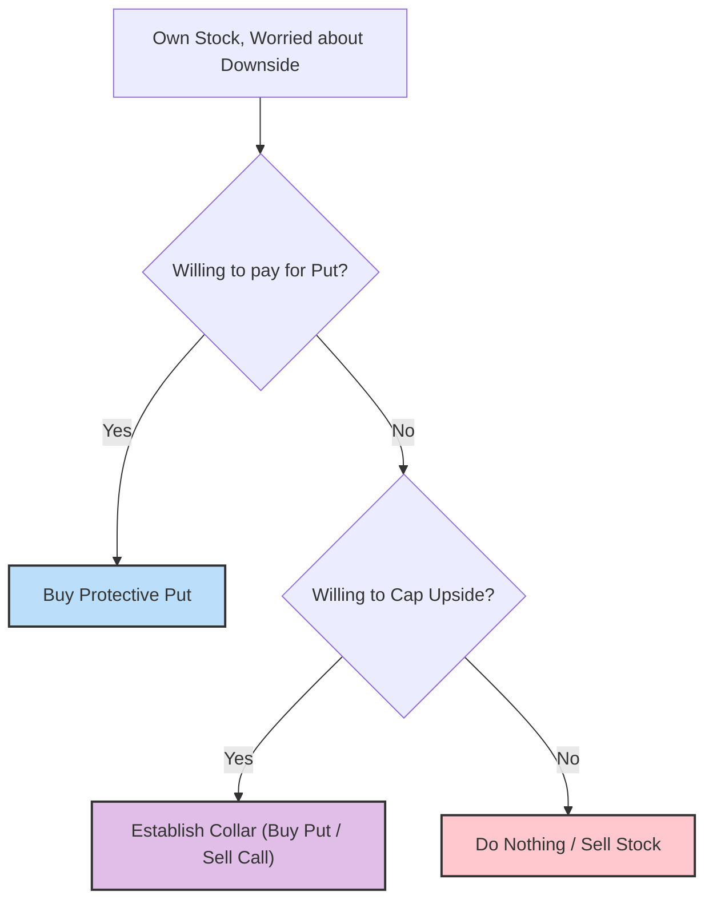

# 🎯 Chapter 17: Put Buying in Conjunction with Common Stock Ownership 📉

Welcome back, Strategist. In the previous chapter, we explored buying puts as an aggressive, speculative strategy. Now, we shift our focus to a more defensive and strategic use of put options.

This chapter covers **using puts to protect your stock portfolio**, effectively acting as an insurance policy. We will also explore strategies like the **"No-Cost Collar"** and discuss the tax implications of these defensive moves.

-----

## 1. The Married Put: Protection for Your Stock

The most straightforward defensive strategy is the **Married Put** (or Protective Put). This involves owning the underlying stock and simultaneously buying a put option on that same stock.

### The Concept: Insurance for Your Portfolio

Buying a put option gives you the right to **sell** your stock at a specific strike price, no matter how low the market price drops. This effectively places a "floor" under your stock position.

  * **Scenario:** You own XYZ stock at $52. You are worried about a short-term decline but want to hold the stock for the long term.
  * **Action:** Buy an XYZ October 50 Put for $2.
  * **Result:**
      * **If XYZ drops to $30:** You can exercise your put and sell your stock at $50. Your loss is limited to the difference between your purchase price ($52) and the strike ($50), plus the cost of the put ($2). Total loss = $4.
      * **If XYZ rises to $80:** The put expires worthless (you lose the $2 premium), but you participate in all the upside of the stock above $54 (your break-even point).

### Profit Profile: Synthetic Long Call

Interestingly, the profit profile of a **Long Stock + Long Put** is identical to that of a **Long Call** option. You have limited risk (the stock price minus the strike price plus the put premium) and unlimited upside potential.

<pre data-lang="vega-lite">
{
  "$schema": "https://vega.github.io/schema/vega-lite/v5.json",
  "background": "#f9f9f9",
  "title": "P/L Diagram: Protective Put (Stock @ 52, Long 50 Put @ 2)",
  "description": "Profit and Loss profile for owning stock and buying a protective put.",
  "width": "container",
  "height": 300,
  "data": {
    "values": [
      {"Stock Price": 30, "P/L": -400},
      {"Stock Price": 40, "P/L": -400},
      {"Stock Price": 50, "P/L": -400},
      {"Stock Price": 54, "P/L": 0},
      {"Stock Price": 60, "P/L": 600},
      {"Stock Price": 70, "P/L": 1600},
      {"Stock Price": 80, "P/L": 2600}
    ]
  },
  "encoding": {
    "x": {
      "field": "Stock Price",
      "type": "quantitative",
      "title": "Stock Price at Expiration ($)",
      "axis": {"grid": true, "labelFontSize": 11, "titleFontSize": 12}
    },
    "y": {
      "field": "P/L",
      "type": "quantitative",
      "title": "Profit / Loss ($)",
      "axis": {"grid": true, "labelFontSize": 11, "titleFontSize": 12}
    }
  },
  "layer": [
    {
      "mark": {"type": "area", "color": "#94f0a6", "opacity": 0.2},
      "transform": [{"filter": "datum['P/L'] >= 0"}]
    },
    {
      "mark": {"type": "area", "color": "#ffc7ce", "opacity": 0.2},
      "transform": [{"filter": "datum['P/L'] <= 0"}]
    },
    {
      "mark": {"type": "rule", "color": "black"},
      "encoding": {"y": {"datum": 0}}
    },
    {
      "mark": {"type": "line", "color": "#00838F", "strokeWidth": 3}
    },
    {
      "mark": {"type": "point", "filled": true, "size": 80},
      "encoding": {
        "color": {
          "condition": [
            {"test": "datum['P/L'] > 0", "value": "#2ca02c"},
            {"test": "datum['P/L'] < 0", "value": "#d62728"}
          ],
          "value": "gray"
        },
        "tooltip": [
          {"field": "Stock Price", "type": "quantitative", "title": "Stock Price"},
          {"field": "P/L", "type": "quantitative", "title": "Profit/Loss"}
        ]
      }
    }
  ],
  "config": {
    "view": {"stroke": null}
  }
}
</pre>

**💡 Samurai Mnemonic: "The Married Put"**
Think of this as a marriage between your stock and a put option. The put promises to protect the stock from falling too hard ("for poorer"), while the stock allows you to enjoy the good times if the market rises ("for richer").

-----

## 2. Selecting Which Put to Buy

Just as with speculative put buying, you must choose the right strike price. The trade-off is between **cost** and **protection**.

### In-the-Money vs. Out-of-the-Money

  * **Out-of-the-Money (OTM) Put:** Less expensive upfront cost ("deductible"). It provides "disaster insurance." You are only protected if the stock crashes significantly below the strike price.
  * **In-the-Money (ITM) Put:** More expensive. It provides tighter protection but limits your upside potential until the stock rallies past the premium paid.

**Recommendation:** Generally, a **slightly out-of-the-money put** offers the best balance between cost and protection.

### Tax Considerations

Using puts to protect stock can have tax consequences.

  * If you buy a put on a stock you have held **short-term** (less than one year), your holding period for the stock is **wiped out**. It starts over only when you dispose of the put.
  * This does not apply if you are already a long-term holder or if you buy the stock and put on the same day (a "married put").

### 🎯 Quick Samurai Pointers

  * **Dividend Capture:** If you use a put to protect a stock just to capture a dividend, be careful. The cost of the put might exceed the dividend income\!
  * **Constructive Sale:** Be aware of tax rules. Buying a put against a short-term stock holding kills your holding period accumulation.

-----

## 3. The "No-Cost" Collar

Many investors balk at the cost of buying protective puts. A popular strategy to offset this cost is the **Collar**.

### The Structure

A Collar is constructed by:

1.  **Owning** the stock.
2.  **Buying** an OTM Put (for protection).
3.  **Selling** an OTM Call (to finance the put).

If structured correctly, the premium received from selling the call can completely pay for the put, creating a **"No-Cost" Collar**.

  * **The Trade-off:** You get free downside protection, BUT you cap your upside potential at the strike price of the call you sold.

### Decision Flow: To Collar or Not?

### Zero-Cost Collar Example

  * **Stock Price:** $100
  * **Buy:** Put strike $90 (Cost: $2)
  * **Sell:** Call strike $115 (Credit: $2)
  * **Net Cost:** $0
  * **Result:** You are protected below $90, and you participate in gains up to $115.

-----

## Summary: The Samurai's Checklist ✅

### 🥋 The Samurai's Scroll

  * **Protective Put:** Buying a put against stock you own creates a synthetic long call. It limits risk while preserving unlimited upside.
  * **Cost:** The put premium is the cost of insurance. It raises your break-even point.
  * **The Collar:** Selling a call to fund the put purchase can reduce or eliminate the out-of-pocket cost, but it caps your upside profit potential.
  * **Tax Rule:** Buying a put on a short-term stock holding resets your holding period for capital gains tax purposes.

