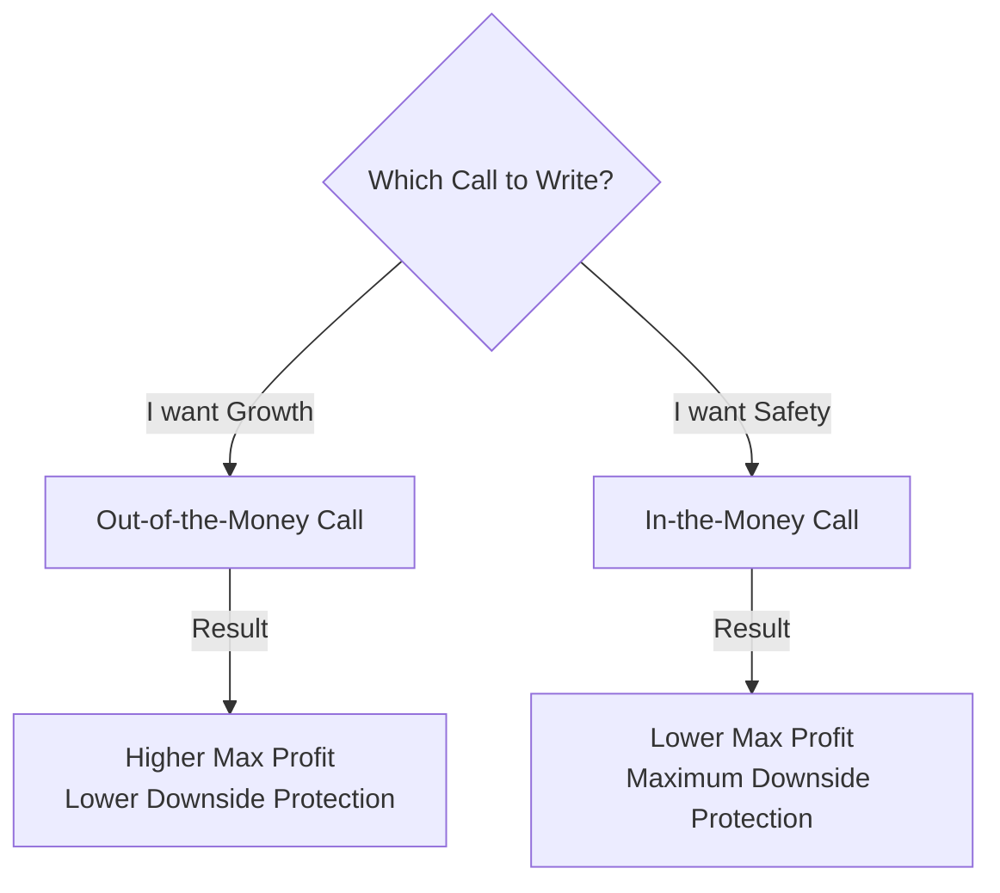

Here is the summary of Chapter 2, designed to be sharp, engaging, and easy to master.

-----

## Chapter 2: Covered Call Writing - The Samurai's Shield 🛡️

### 🎯 Introduction

Welcome back to the dojo\! Now that you know the basic stances (definitions), it is time to learn your first true defense strategy: **Covered Call Writing**.

This is widely considered one of the most conservative and popular strategies in the options world. Think of it as owning a house (the stock) and renting it out to collect monthly income (the option premium). It reduces your risk and increases your income—a disciplined path to steady profits\! 🧘‍♂️

-----

### Part 1: What is Covered Call Writing?

Covered Call Writing is a two-part move executed simultaneously (or sequentially):

1.  **Buy/Own** 100 shares of a stock.
2.  **Sell (Write)** 1 Call Option against that stock.

**Why do we do this?**

  * **Income:** You collect the "premium" immediately from selling the call.
  * **Protection:** The premium acts as a buffer (a shield) against a drop in the stock price.

#### 1.1 The Philosophy

You should be **mildly bullish** or **neutral** on the stock.

  * If you are *extremely* bullish 🚀: Don't write calls (you limit your profit).
  * If you are *bearish* 📉: Sell the stock\! Don't write calls on a sinking ship.

The goal is **Total Return**. We care about the combination of dividends + option premium + stock appreciation.

-----

### Part 2: The Mechanics of Risk and Reward

When you write a covered call, you are making a trade-off. You are giving up **future unlimited upside** in exchange for **certain immediate income**.

#### 2.1 The Three Outcomes

Imagine you bought XYZ stock at **$48** and sold a **July 50 Call** for **$3**.

  * **Cost Basis:** $48 (Stock) - $3 (Premium) = **$45\*\*. This is your *Break-Even Point*.

| Scenario | Stock Price at Expiration | Result | Samurai Analysis |
| :--- | :--- | :--- | :--- |
| **Stock Falls** 📉 | Below $45 | Loss | You lose money, but *less* than if you just owned the stock. The $3 premium cushioned the blow. |
| **Stock Stays** 😐 | Between $45 and $50 | Profit | You keep the stock, the dividend, and the $3 premium. Great income\! |
| **Stock Rises** 🚀 | Above $50 | Max Profit | Your stock is "called away" at $50. You keep the $2 stock gain ($48->$50) + $3 premium. Total = $5. |

**⚠️ Important:** If the stock goes to $100, you still only sell at $50. That is the "opportunity cost."

#### 2.2 Calculating Returns (The Math of the Sword)

To be a true master, you must calculate your potential returns *before* you trade.

1.  **Return if Unchanged:**
    $$\frac{\text{Call Premium} + \text{Dividends}}{\text{Net Investment}}$$
    *(This is what you make if the stock goes nowhere\!)*

2.  **Return if Exercised:**
    $$\frac{\text{Call Premium} + \text{Dividends} + \text{Profit on Stock}}{\text{Net Investment}}$$
    *(This is your maximum possible profit.)*

**💡 Samurai Mnemonic: "The Bird in the Hand"**
Covered writing is preferring the bird in the hand (the premium you pocket today) over the two in the bush (the potential for the stock to skyrocket tomorrow).

-----

### Part 3: In-the-Money vs. Out-of-the-Money

You can choose different "Strikes" to adjust your defense.

#### 3.1 Out-of-the-Money (OTM) Writing (Aggressive)

  * **Stock at $48**, Sell **$50 Call**.
  * **Pros:** Higher maximum profit potential (you profit from stock rise + premium).
  * **Cons:** Less downside protection (smaller premium collected).
  * **Use when:** You are bullish and want capital gains.

#### 3.2 In-the-Money (ITM) Writing (Defensive)

  * **Stock at $48**, Sell **$45 Call**.
  * **Pros:** Huge downside protection. The stock can fall to $45 and you still make max profit.
  * **Cons:** Lower max profit. You usually only earn the "Time Value."
  * **Use when:** You want safety and steady income (Total Return Concept).

<!-- end list -->

-----

### Part 4: Execution & "Net" Orders

Never execute the two parts of this trade separately ("legging in"). The market moves too fast\!

  * **The Net Order:** Tell your broker you want to "Buy the stock and Sell the call at a **Net Debit**."
  * **Example:** Stock is $43, Option is $3. You place a limit order for a **Net Debit of $40**.
  * This guarantees your break-even price instantly.

-----

### Part 5: Follow-Up Action (The Battle isn't Over\!)

Once you enter the trade, you cannot just fall asleep. The market moves, and you must react.

#### 5.1 If the Stock Drops 📉

  * **Protective Action:** The call you sold becomes cheaper. Buy it back (close it) for a profit\!
  * **Rolling Down:** Buy back the old call and sell a *new* call at a lower strike price. This brings in more cash and lowers your break-even point further.

#### 5.2 If the Stock Rises 📈

  * **Do Nothing:** Let the stock be called away. Take your max profit and find a new trade.
  * **Roll Up:** If you really love the stock, buy back the current call (at a loss) and sell a higher strike call. (Caution: This increases risk and raises your break-even point).

#### 5.3 Avoiding Assignment

  * If the option is **In-the-Money** near expiration, or just before a **Dividend** date, you are at risk of assignment.
  * **Action:** "Roll Forward." Buy back the current call and sell a call in a future month (e.g., buy Jan, sell April). This captures more time value.

-----

### Summary: The Samurai's Checklist ✅

  * **The Goal:** Consistent income and reduced volatility. Not "Get Rich Quick."
  * **The Trade:** Long Stock + Short Call.
  * **The Risk:** The stock drops significantly (but you are hurt less than a regular stockholder).
  * **The Limit:** You cap your upside. If the stock doubles, you don't participate beyond the strike.
  * **Downside Protection:** Calculated as: Stock Price - Call Premium.
  * **Diversification:** You can write calls against **Common Stock**, **Convertible Bonds**, or **LEAPS** (long-term options).

### 🎯 Quick Samurai Pointers

  * **Don't be greedy:** If you make 80% of your potential profit in 20% of the time, consider closing the trade early\!
  * **Dividends:** Remember, if you are called away before the ex-dividend date, you lose the dividend.
  * **Partial Writing:** You don't have to write calls on *all* your stock. Keep some shares "naked" to capture big rallies\!

