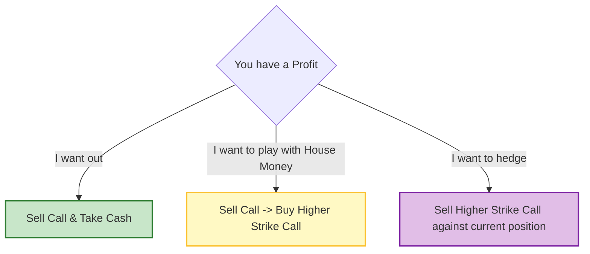

Here is the detailed summary of **Chapter 3: Call Buying**, tailored to the Samurai Options format.

-----

## Chapter 3: Call Buying - The Way of the Aggressive Warrior ⚔️

### 🎯 Introduction

Welcome back, Options Samurai\! 🥋 In Chapter 2, we learned the defensive art of Covered Call Writing. Now, we unsheathe our swords for an offensive strategy: **Call Buying**.

Buying calls is the simplest and most popular strategy for the public investor. It offers the power of **Leverage**—controlling large amounts of stock with a small amount of capital. But be warned: the path of the call buyer requires precision. You must pick the right stock and the right time, or your premium will wither away like a leaf in winter. Let’s learn how to wield this powerful weapon\!

-----

### Part 1: The Power of the Call (Why Buy?)

Why would a Samurai buy a call instead of just buying the stock? Two words: **Leverage** and **Limited Risk**.

  * **Leverage:** You can realize huge percentage profits from a modest rise in the stock price.
  * **Limited Risk:** You can never lose more than the price you paid for the option (the premium), even if the stock goes to zero\! 

**🧮 Samurai Example: The Power of Leverage**

  * **Scenario:** Stock XYZ is at **$48**. You buy a **July 50 Call** for **$3** ($300 investment).
  * **Stock Rises:** XYZ goes to **$58** (+20%).
  * **Option Result:** The call is now worth at least \*\*$8** ($800).
  * **Profit:** You turned **$300** into **$800**. That is a **167% gain** on a 20% stock move\! 

**Other Uses:**

  * **Diversification:** Use small amounts of cash to speculate on volatile stocks without risking your entire portfolio.
  * **Locking in a Price:** If you expect a cash windfall later but want to buy a stock *now*, buy calls to "fix" the price. 

-----

### Part 2: Selecting Your Weapon (Risk vs. Reward)

The most important decision a call buyer makes is **Stock Selection**. Even the best option strategy will fail if the stock goes down\!. Once you are bullish, which option do you choose?

#### 2.1 In-the-Money (ITM) vs. Out-of-the-Money (OTM)

  * **Out-of-the-Money (OTM):** (e.g., Stock at 65, Buy 70 Call)
      * **High Reward:** If the stock skyrockets, these offer the massive percentage gains.
      * **High Risk:** If the stock only rises a little, you might still lose 100% of your money.
  * **In-the-Money (ITM):** (e.g., Stock at 65, Buy 60 Call)
      * **Higher Probability:** The option already has value.
      * **Better Defense:** If the stock drops slightly, you might not lose your entire investment. 

#### 2.2 Time Remaining

  * **Short-Term:** Tracks the stock price closely but carries the highest risk if the move doesn't happen immediately.
  * **Intermediate-Term:** Often the most attractive balance of risk and reward.
  * **Long-Term:** Offers the least risk (more time to be right), but the lowest percentage reward. 

-----

### Part 3: The Delta - The Speed of the Strike ⚡

To understand how your option will move, you must understand **The Delta**.
**Delta** is the amount the option price will change for a **1-point move** in the stock.

  * **Deep ITM Call:** Delta is close to **1.00** (Moves point-for-point with the stock).
  * **At-the-Money Call:** Delta is usually around **0.50** (Moves 50 cents for every $1 stock move).
  * **Deep OTM Call:** Delta is close to **0** (Hardly moves at all). 

**💡 Samurai Mnemonic: "Delta determines Dollars"**
If you want a quick profit on a small move, buy **high Delta** (In-the-Money).
If you are betting on a miracle explosion, buy **low Delta** (Out-of-the-Money).

-----

### Part 4: Follow-Up Action - Tactics for Victory 🚩

A Samurai does not strike and then freeze. You must react to the market\!

#### 4.1 Locking in Profits

If your stock rises and you have a profit, you have four main choices to manage your victory:

1.  **Liquidate:** Sell the call and take the cash. (Safest, but you lose future upside).
2.  **Roll Up:** Sell your current call (take your profit) and use *some* of the money to buy a higher strike call (OTM).
      * *Result:* You pocket your original investment and keep "playing with the house's money." 
3.  **Spread:** Sell a higher strike call against the one you own. This creates a **Bull Spread**.
      * *Result:* No new risk, and you lock in a profit range. 
4.  **Do Nothing:** Hold and hope for more gains. ( riskiest option).

#### 4.2 Defensive Action (The Stock Drops)

If the stock falls, do not simply hope.

  * **Cut Losses:** Sell the option. Don't hold a losing position hoping for a miracle.
  * **Rolling Down:** If you have a loss but still think the stock might rebound, you can create a spread by selling two lower strike calls against your position. This lowers your break-even point. 

<!-- end list -->

-----

### Summary: The Samurai's Checklist ✅

  * **Leverage:** Buying calls offers high percentage returns for limited dollar risk.
  * **Selection:** Don't just buy the "cheapest" option. Analyse the stock's volatility.
  * **Delta:** Use Delta to predict how much your option will move.
  * **Taking Profits:** Don't be greedy. Use "Rolling Up" or "Spreading" to lock in gains.
  * **Exercise:** It is rarely profitable to exercise a call (you lose the time value). Sell it in the secondary market instead\! 

### 🎯 Quick Samurai Pointers

  * **Volatility:** Higher volatility stocks have more expensive options, but they are also more likely to make the big moves you need.
  * **Wasting Asset:** Remember, time is your enemy. Every day you hold the call, it loses a little value (Time Decay).
  * **Allocation:** Never put more than 15% of your risk capital into speculative call buying. 

