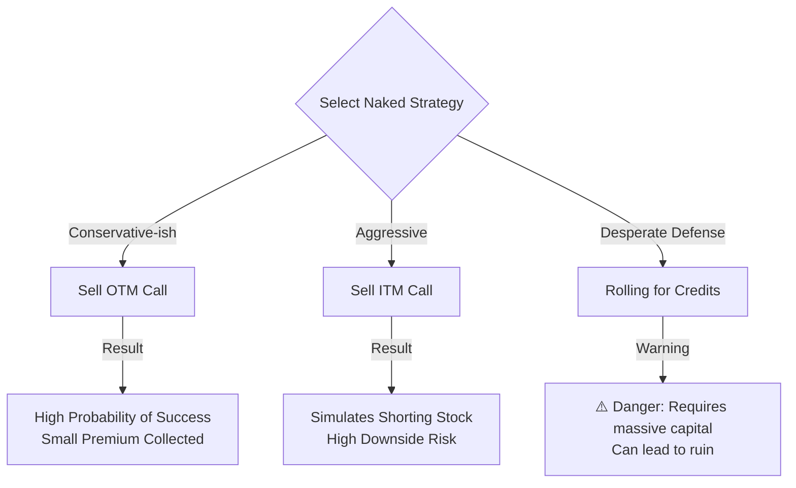

Here is the summary of Chapter 5, crafted for the brave Options Samurai.

-----

## Chapter 5: Naked Call Writing - Walking the Razor's Edge 🗡️

### 🎯 Introduction

Welcome back, warrior\! 🥋 We have learned to use the sword (buying calls) and the shield (covered writing). Now, we approach a technique that requires nerves of steel and a deep chest of gold: **Naked Call Writing** (Uncovered Calls).

To "write naked" means to sell a call option *without* owning the underlying stock. It is a strategy of **Limited Profit** and **Theoretically Unlimited Risk**. Why would a Samurai choose such a dangerous path? Because it requires **no cash investment** (if you have collateral) and allows you to profit even if the market stays still. But beware: this path is not for the faint of heart\! 🌩️

-----

### Part 1: The Naked Call Defined

When you write a naked call, you become the "House." You sell the hope of a stock rise to someone else.

  * **The Trade:** Sell (Write) a Call Option *without* owning the stock.
  * **The Obligation:** If assigned, you *must* sell the stock at the strike price. Since you don't own it, you must go into the market and buy it at the *current* (potentially huge) price to deliver it.
  * **The Reward:** You keep the **Premium** received. This is your maximum profit.

Naked Call Profit Profile

<pre data-lang="vega-lite">
{
    "$schema": "https://vega.github.io/schema/vega-lite/v5.json",
    "background": "#f9f9f9",
    "description": "Naked Call Profit Profile",
    "data": {
        "values": [
            { "S": 40, "profit": 5 },
            { "S": 50, "profit": 5 },
            { "S": 55, "profit": 0 },
            { "S": 60, "profit": -5 },
            { "S": 70, "profit": -15 }
        ]
    },
    "width": "container",
    "height": 320,
    "encoding": {
        "x": { "field": "S", "type": "quantitative", "title": "Stock Price at Expiration ($)" },
        "y": { "field": "profit", "type": "quantitative", "title": "Profit ($)" },
        "tooltip": [
            { "field": "S", "type": "quantitative", "title": "Stock Price" },
            { "field": "profit", "type": "quantitative", "title": "Profit" }
        ]
    },
    "layer": [
        {
            "mark": { "type": "area", "color": "#94f0a6", "opacity": 0.2 },
            "transform": [ { "filter": "datum.profit >= 0" } ]
        },
        {
            "mark": { "type": "area", "color": "#ffc7ce", "opacity": 0.2 },
            "transform": [ { "filter": "datum.profit <= 0" } ]
        },
        {
            "mark": { "type": "rule", "color": "black" },
            "encoding": { "y": { "datum": 0 } }
        },
        {
            "mark": { "type": "line", "color": "#1f77b4" }
        },
        {
            "mark": { "type": "point", "filled": true, "size": 80 },
            "encoding": {
                "color": {
                    "condition": [
                        { "test": "datum.profit > 0", "value": "#2ca02c" },
                        { "test": "datum.profit < 0", "value": "#d62728" }
                    ],
                    "value": "gray"
                }
            }
        },
        {
            "mark": { "type": "rule", "color": "gray", "strokeDash": [ 4, 2 ] },
            "encoding": { "x": { "datum": 55 }, "opacity": { "value": 0.6 } }
        }
    ]
}
</pre>

#### 1.1 Risk vs. Reward Profile

Let's look at the battlefield with an example:

  * **Stock XYZ:** $50
  * **Sell July 50 Call:** For $5 Premium.

| Scenario | Stock Price at Expiration | Result | Samurai Analysis |
| :--- | :--- | :--- | :--- |
| **Stock Falls** 📉 | Below $50 | **Max Profit ($5)\*\* | The option expires worthless. You keep the full $500 premium. |
| **Stock Stays** 😐 | At $50 | **Max Profit ($5)\*\* | Same as above. Time decay is your ally. |
| **Stock Rises** 🚀 | To $60 | **Loss ($5)\*\* | You must sell at $50 but buy at $60. Loss = $10 - $5 premium = $5 loss. |
| **Stock Rockets** 💥 | To $100 | **Huge Loss ($45)\*\* | Loss = $50 stock loss - $5 premium = $45 loss\! Risk is theoretically infinite. |

**💡 Samurai Mnemonic: "Naked is Exposed"**
When you write **Naked**, your upside is capped (the premium), but your downside is **Exposed** to the sky. If the stock goes to the moon 🌙, your account goes to the grave 🪦.

-----

### Part 2: Naked Call vs. Shorting Stock

Both strategies are Bearish 🐻, but they behave differently.

  * **Shorting Stock:** You profit point-for-point as the stock drops. You have unlimited risk if it rises.
  * **Naked Call:** You have a "cushion" (the premium). If the stock rises slightly, you can still make money or break even.

**Comparison:**
If the stock stays flat ($50), the **Short Seller** makes $0. The **Naked Writer** makes $500 (the premium). However, if the stock crashes to $20, the Short Seller wins big, while the Naked Writer's profit is capped at $5.

-----

### Part 3: The Cost of Battle (Investment & Margin)

You do not need cash to enter this trade if you have marginable securities (like T-bills or other stocks) to post as **Collateral**.

#### 3.1 The Margin Formula

The exchange requires you to hold a specific amount of equity to handle potential losses.

`Margin Requirement = 20% of Stock Price + Premium - Out-of-the-Money Amount` 
*(Subject to a minimum of 10% of the stock price)*.

  * **Marked to Market:** Every day, if the stock moves against you (up), you must put up *more* money (Maintenance Margin).

-----

### Part 4: Strategies - Choosing Your Ground

#### 4.1 Selling Out-of-the-Money (OTM)

  * **Strategy:** Sell calls with a strike price *higher* than the current stock price (e.g., Stock at 40, Sell 50 Call).
  * **Probability:** High probability of profit (the stock has to move a lot to hurt you).
  * **Risk:** The "Steamroller." You pick up small premiums (pennies) constantly, but one bad trade (the steamroller) can wipe out months of profits.

#### 4.2 Selling In-the-Money (ITM)

  * **Strategy:** Sell calls with a strike *lower* than the stock price.
  * **Behavior:** This simulates shorting the stock but with less cash required.
  * **Risk:** High. If the stock rises, you lose money immediately.

#### 4.3 Rolling for Credits (The Martingale)

  * **Concept:** If the stock rises and threatens your naked call, you buy it back (at a loss) and sell *more* calls at a higher strike and longer expiration to get a Net Credit.
  * **Samurai Warning:** This is a "Martingale" strategy (doubling your bet when you lose). It works... until it doesn't. If the stock keeps rising, you eventually run out of collateral and face total ruin.

<!-- end list -->

-----

### Summary: The Samurai's Checklist ✅

  * **Psychology:** Ask yourself: "Can I sleep at night knowing I have unlimited risk?" If the answer is no, do not write naked calls.
  * **Monitoring:** You must watch the market daily. A gap up in price can be disastrous.
  * **Collateral:** You can use interest-bearing T-bills as collateral, earning interest *while* you trade.
  * **The Myth:** Do not believe that "most options expire worthless" means easy money. Volatility can destroy you even if time decay is on your side.
  * **Defense:** Be prepared to cover (buy back) your calls if the stock breaks out. Do not be stubborn\!

### 🎯 Quick Samurai Pointers

  * **Wasting Asset:** Time value decays fastest in the last few weeks. This is the naked writer's greatest ally.
  * **Diversification:** Never sell naked calls on just one stock. One takeover announcement could wipe you out. Diversify to spread the risk.
  * **Suitability:** This strategy is generally for sophisticated traders with significant capital.

