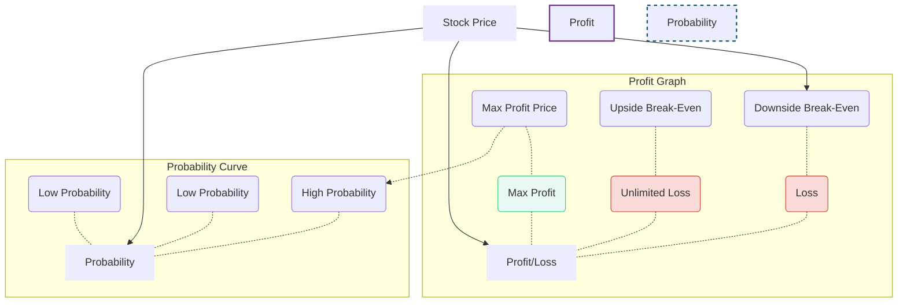
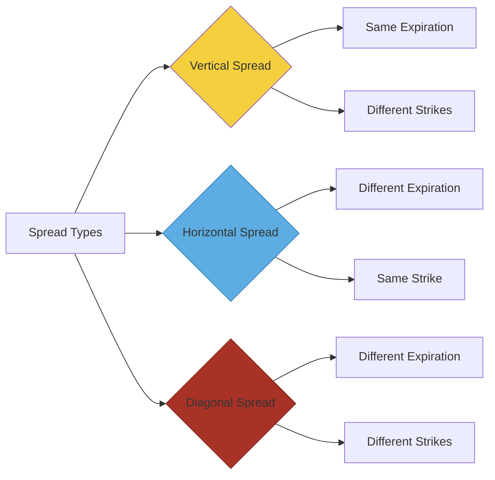

## Chapter 6: Ratio Call Writing — The Balanced Samurai Stance 🧘‍♂️

### 🎯 Introduction: What is a Ratio Write?

A **Ratio Call Write** is a powerful combination strategy that blends the protection of **covered call writing** with the enhanced premium collection of **naked call writing**.

Simply put, you establish a ratio write by:

1.  **Buying/Owning a number of shares of the underlying stock**.
2.  **Selling (Writing) a greater number of Call Options** against those shares than you own.

The most common starting point for beginners is the **2:1 Ratio**.

  * **Example:** Buy 100 shares of stock and **Sell 2 Call Contracts**.

| Component | Number of Contracts/Shares |
| :--- | :--- |
| **Covered Portion** | Long 100 shares + Short 1 Call |
| **Naked Portion** | Short 1 additional Call |
| **Total Position** | **Long 100 Stock + Short 2 Calls (2:1 Ratio)** |

-----

### 📈 Risk & Reward: Two-Sided Mastery

The Ratio Write is usually initiated with a **neutral market outlook**—you expect the stock price to remain relatively unchanged during the life of the calls. This strategy is designed to achieve its **maximum profit** in the price range that is **most probable** for the stock.

#### **The Two-Sided Risk**

The Ratio Write has two-sided risk, a quality absent from simple covered or naked writing:

1.  **Downside Risk (Like a Covered Write):** If the stock price falls, you lose money on the stock. The collected premium from the short calls offsets a large portion of this loss.
2.  **Unlimited Upside Risk (Like a Naked Write):** If the stock price rises **significantly** above the strike price, the extra naked call creates an unlimited loss potential.

#### **Profit Profile Diagram (The "Peak" Strategy)**

The diagram below shows how the ratio write's profit (the peak) is aligned with the most likely outcomes for a stock's movement (the bell curve).

Ratio Write Profit Profile vs. Stock Price Probability

*The "peak" of maximum profit is in the range of most likely stock prices.*

-----

### 💡 Selection & Calculation for a 2:1 Ratio Write

The key to selecting a good ratio write is ensuring your **profit range is wide in relation to the volatility** of the stock. Generally, **volatile stocks** are the best candidates, as they offer the largest premium (call price) to take in.

#### **The Break-Even Formulas**

To quickly calculate your risk boundaries for a standard 2:1 ratio (100 shares long, 2 calls short):

| Concept | Formula (Use the short formula for quick checks\!) |
| :--- | :--- |
| **Points of Maximum Profit (PMP)** | `Strike Price - Stock Price + 2 x Call Price`  |
| **Downside Break-Even (DBE)** | `Stock Price - (2 x Call Price)`  |
| **Upside Break-Even (UBE)** | `Strike Price + PMP`  |

#### **Example Calculation**

  * **Setup:** Buy 100 XYZ at **$49**. Sell 2 October **$50** Calls at **$6** each.
  * **PMP:** $50 - 49 + (2 \times 6) = 1 + 12 = 13 (Max profit is $1,300).
  * **DBE:** $49 - (2 \times 6) = 49 - 12 = 37 (The stock can fall 12 points before you lose money).
  * **UBE:** $50 + 13 = 63.

-----

### The Variable Ratio Write (Trapezoidal Hedge)

If you are a bit more flexible in your outlook, you can create a structure with two different strike prices. This is known as a **Variable Ratio Write** or, due to its profit shape, a **Trapezoidal Hedge**.

  * **Structure:** Buy 100 shares of stock. Sell one call at a lower strike price ($X_L$) and another call at a higher strike price ($X_H$).
  * **Maximum Profit Zone:** The maximum profit is achieved if the stock price lands **anywhere between the two strikes** at expiration (i.e., $X_L < \text{Stock Price} < X_H$).
  * **Maximum Profit Amount:** The maximum profit is simply the total **time value** premium collected when the trade was initiated.

**Variable Ratio Write Mnemonics: T-V-S**

  * **T**rapezoid (The shape of the profit graph).
  * **V**ariable (Uses different strikes, not just one).
  * **S**afe Spot (Max profit is in the **middle** of the two strikes).

-----

### 🛠️ Follow-Up Action: Being a Responsive Samurai

Because the Ratio Write has unlimited risk on the upside, you cannot simply set it and forget it. You must have a follow-up plan.

#### 1\. Rolling Up (The Offensive Maneuver)

If the stock starts to rally (moves against your neutral position), you can **roll up** the position to re-establish a neutral profit range:

1.  **Buy back** the original short calls (which will result in a loss on the calls). This loss effectively **increases your cost basis** in the stock.
2.  **Sell (Write) a new set of calls** at a higher strike price.

#### 2\. Equivalent Stock Position (ESP) & Delta-Neutrality

The **Equivalent Stock Position (ESP)** (also known as **Position Delta**) is a vital concept that reduces your entire, complex options position into a single number that tells you how the position will behave for a small movement in the stock price.

  * **Goal:** A total ESP of **0** is a perfectly **delta-neutral** position.
  * **Calculation:**
    $$\text{Total ESP} = (\text{Shares Long}) - (\text{Number of Short Calls} \times \text{Call Delta} \times 100)$$

If your ESP is negative (short), you are bearish. If it's positive (long), you are bullish. To adjust to neutral (ESP = 0), you could buy shares or buy back options.

**Important Caveat:** A position is only truly **delta-neutral** for a "nanosecond." As the stock moves, time passes, or volatility changes, the delta shifts, and the position is no longer neutral.

#### 3\. Using Stop Orders (The Defensive Maneuver)

To remove emotion, place a **buy stop** and a **sell stop** order as soon as you establish the position.

  * A **Buy Stop** (to close the short calls) is placed if the stock moves up to a certain point.
  * A **Sell Stop** (to close the stock) is placed if the stock moves down to a certain point.
  * **Caution:** This protects against large losses but is subject to loss if the stock **whipsaws** (reverses direction sharply).

-----

### 📜 Introduction to Call Spread Strategies

Chapter 6 concludes with a peek into the world of spreads, which are combinations of two or more options on the same underlying security. All spreads fall into three broad categories based on their relationship on an option price board:

The Three Option Spread Types

1.  **Vertical Spread:** The calls have the **Same Expiration Date** but **Different Striking Prices** (think of columns running vertically in a newspaper listing).
2.  **Horizontal Spread (Calendar Spread):** The calls have the **Same Striking Price** but **Different Expiration Dates**.
3.  **Diagonal Spread:** A combination—calls have **Different Expiration Dates** as well as **Different Striking Prices**.