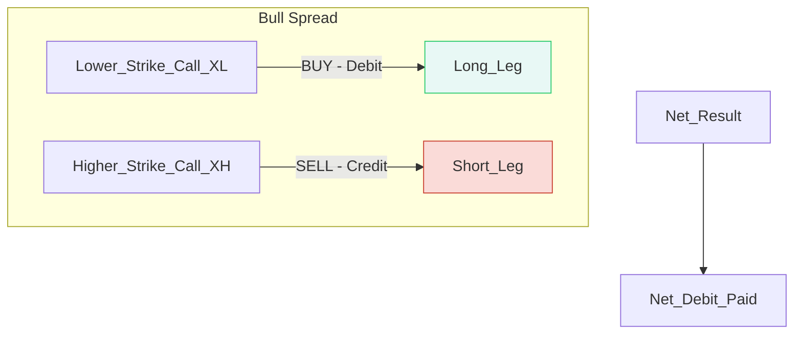

Hark, future Samurai of the markets\! 🗡️ Your training progresses well.

Having mastered the mixed stance of the Ratio Write, you are now ready for a controlled, directional attack. Chapter 7 introduces one of the most foundational and popular vertical spread strategies: the **Bull Spread**. This is the strategy of a Samurai who believes the terrain is rising but understands the value of managing risk.

-----

## Chapter 7: Bull Spreads — The Controlled Ascent 🧗‍♂️

### 🎯 The Strategy: Definition and Philosophy

A **Bull Call Spread** (often just called a Bull Spread) is a two-part options strategy designed for traders who are **bullish, but not overly aggressive**.

It is a **vertical spread** because both options use the **same expiration date** but **different striking prices**.

#### **The Two-Part Structure**

You create a Bull Spread by:

1.  **Buying (Going Long)** a Call Option at a **Lower Striking Price** ($X_L$).
2.  **Selling (Writing)** a Call Option at a **Higher Striking Price** ($X_H$).

Since the call with the lower strike price is always more valuable (more intrinsic value and/or premium) than the higher strike call, you must pay a net amount to enter the trade. This is established for a **Net Debit**.

Bull Spread Structure (The Vertical Wall)

*You pay the net debit upfront for limited risk and limited profit.*

-----

### ⚖️ Risk, Reward, and Key Formulas

The Bull Spread is characterized by **limited risk and limited reward**. This is its strength and its constraint. The limited risk makes it an attractive starting point for spread strategies.

#### **The Samurai’s Profit Metrics**

| Metric | Formula | Mnemonic: **B.A.D.** |
| :--- | :--- | :--- |
| **Maximum Loss (Max Risk)** | **Net Debit** Paid + Commissions | **B**reak-even = $X_L + \text{Debit}$ |
| **Maximum Profit (Max Reward)** | $(X_H - X_L) - \text{Net Debit}$ | **A**ll-in Max Loss = **Debit** |
| **Break-Even Point (BEP)** | $X_L + \text{Net Debit}$ | **D**efault Max Profit = $X_H - X_L - \text{Debit}$ |

#### **Example Calculation**

  * **Stock XYZ:** Trading at $33
  * **Strategy:** Buy the Oct $30 Call for $4.00 ($X_L$). Sell the Oct $35 Call for $2.00 ($X_H$).
  * **Net Debit:** $4.00 - $2.00 = **$2.00\*\* (or $200 per spread).

<!-- end list -->

1.  **Maximum Loss:** $2.00 (The Net Debit paid).
2.  **Break-Even Point (BEP):** $30 (Lower Strike) + $2.00 (Net Debit) = **$32\*\*.
3.  **Maximum Profit:** ($35 - $30) - $2.00 = $5.00 - $2.00 = **$3.00\*\* (or $300 per spread).

The position reaches its maximum profit if the stock is at or above the **Higher Striking Price ($X_H)$** at expiration.

-----

### 🆚 Bull Spread vs. Outright Call Purchase

The Bull Spread is often used as a substitute for buying a single call outright. The choice depends on your prediction for the stock's future movement.

| Scenario | Strategy Winner | Reason/Keywords |
| :--- | :--- | :--- |
| **Quick, Large Upward Move** | **Outright Call** | Profits are unlimited. You capitalize fully on the initial volatility surge. |
| **Slow, Moderate Advance** | **Bull Spread** | It will **outperform** the outright call, both dollar-wise and percent-wise, because the premium from the short call offsets the cost of time decay. |
| **High Implied Volatility (IV)** | **Outright Call** | High IV is a "friendly ally" to the outright long call, but **not a friend** to the bull spread. |
| **Risk Minimization** | **Bull Spread** | It always involves **fewer actual dollars of risk** because of the lower initial debit. |

**Mnemonic: S.M.A.R.T. Spread**

  * **S**pread is better for a **S**low, **M**oderate **A**dvance.
  * **R**isk is **T**ight (limited).

-----

### 📏 Degrees of Aggressiveness (Selecting Your Strikes)

The strikes you choose define the aggressiveness of the spread, which controls your cost, potential profit, and probability of success.

| Aggressiveness Level | Long Call ($X_L$) | Short Call ($X_H$) | Net Debit | Risk/Reward Profile |
| :--- | :--- | :--- | :--- | :--- |
| **Least Aggressive** | Deep **In-the-Money (ITM)** | **At-the-Money (ATM)** | Highest Debit  | Highest probability of profit, lowest percentage return. |
| **Moderately Aggressive** | **At-the-Money (ATM)** | **Out-of-the-Money (OTM)** | Medium Debit  | Most common, balanced risk/reward. |
| **Most Aggressive** | **Out-of-the-Money (OTM)** | Deep **Out-of-the-Money (OTM)** | Lowest Debit  | Highest percentage return, lowest probability of profit (Max profit price is far from current price). |

**Crucial Ranking Note:** Do **not** rank spreads by their maximum potential profits alone\! This metric will always give the most weight to the aggressive (deeply OTM) spreads, which have the lowest probability of actually reaching that profit.

-----

### 🛠️ Follow-Up Actions: Managing the Spread

A Samurai is prepared for every outcome, even success. Managing a successful spread is about maximizing the capped profit.

#### 1\. The Decision to "Leg Out"

If the stock rallies significantly, the long call ($X_L$) will gain in value, and the short call ($X_H$) will lose its time value premium. You might consider "legging out" by:

  * **Buying back** the short call ($X_H$). If you can repurchase it for a very low price (e.g., $1/8$ or $1/16$), you are effectively closing the short side with minimal cost.
  * **Letting the long call ($X_L$) run** as an outright long position. This removes the cap on your profit, but simultaneously exposes you to the **unlimited loss risk** of a single long call (losing the entire premium) if the stock reverses.

**Warning:** Generally, it is a **poor idea to "leg" into or out of a spread** by placing separate buy/sell orders. It exposes the trader to unnecessary market movement risk.

#### 2\. Other Strategic Uses

The Bull Spread is a flexible tool for existing stock or option positions:

  * **Rolling Down (Reducing Loss on a Long Call):** If you initially bought a single call (Chapter 3) and it is now losing money, you can **sell a lower strike call** against it. This creates a bull spread, brings in a credit, and effectively **lowers your break-even point**.
  * **Locking in Profit (On a Long Call):** If your outright long call is showing a good profit, you can **sell a higher strike call** against it. This creates a bull spread and **locks in** a portion of that profit while the position potentially increases the spread's value.
  * **Lowering a Stock’s Break-Even:** A common stockholder with an unrealized loss can utilize a bull spread to lower the effective break-even price of their common stock.