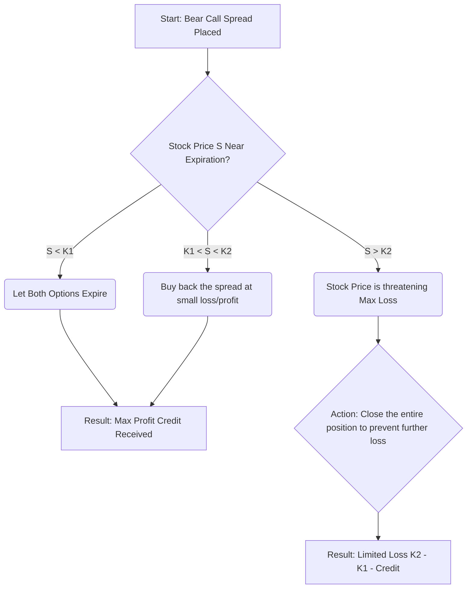

# 🎯 Chapter 8: Bear Spreads Using Call Options 🐻

Welcome, fellow options novice, to a powerful and relatively conservative strategy\! As the "Stock Options Samurai," I'm here to show you how to use a **Bear Spread Using Call Options**—a clever technique that allows you to profit when you expect a stock to move *down slightly* or, more importantly, to *not move up much at all*.

This strategy is all about collecting an immediate premium (cash\!) while precisely defining your maximum risk. Let's master the art of the Bear Call Spread\!

-----

## 1. The Bear Spread: A Strategy for Limited Downside

The **Bear Spread Using Call Options** (often called a **Bear Call Spread**) is a vertical spread strategy. It is implemented when you anticipate a modest or limited decline in the price of the underlying stock, or simply believe the stock's upward movement will be contained.

### Constructing the Bear Call Spread

This spread is built by simultaneously selling one call option and buying another call option, both having the same expiration date but different strike prices.

| Action | Option Detail | Rationale |
| :--- | :--- | :--- |
| **Sell** (Write) | A Call Option with the **Lower** Strike (K1) | Collects a larger premium, as this option is closer to or in-the-money. |
| **Buy** (Long) | A Call Option with the **Higher** Strike (K2) | Costs less premium, but caps your potential loss. |

Since you sell the lower-strike call (which has more intrinsic value and thus a higher premium) and buy the higher-strike call, this strategy results in a **Net Credit** (you receive cash upfront).

**💡 Samurai Mnemonic: "Bear Call Spreads Get Credit"**
If you are **B**earish and use **C**alls, you receive a **C**redit. You profit if the stock stays **B**elow both strike prices.

### Profit & Loss Dynamics

This spread provides a limited profit but also a limited, defined risk.

  * **Maximum Profit:** The initial **Net Credit** received. You achieve this if the stock price closes *below* the lower strike (K1) at expiration, making both options expire worthless.
  * **Maximum Loss:** The difference between the two strike prices (K2 - K1) minus the initial Net Credit received. This is the risk you define when you initiate the trade. You hit max loss if the stock closes *above* the higher strike (K2).
  * **Breakeven Point (B/E):** Lower Strike Price (K1) + Net Credit Received.

<pre data-lang="vega-lite">
{
  "$schema": "https://vega.github.io/schema/vega-lite/v5.json",
  "background": "#f9f9f9",
  "title": "Profit/Loss Diagram for a Bear Call Spread",
  "description": "A bear call spread (Short 50 Call, Long 55 Call, $1.50 Credit) showing limited profit and limited loss.",
  "width": "container",
  "height": 300,
  "data": {
    "values": [
      {"Stock Price": 45, "P/L": 1.50},
      {"Stock Price": 50, "P/L": 1.50},
      {"Stock Price": 51.5, "P/L": 0},
      {"Stock Price": 55, "P/L": -3.50},
      {"Stock Price": 60, "P/L": -3.50}
    ]
  },
  "encoding": {
    "x": {"field": "Stock Price", "type": "quantitative", "title": "Stock Price at Expiration"},
    "y": {"field": "P/L", "type": "quantitative", "title": "Profit / Loss (P/L)"}
  },
  "layer": [
    {
      "mark": {"type": "area", "color": "#94f0a6", "opacity": 0.2},
      "transform": [{"filter": "datum['P/L'] >= 0"}]
    },
    {
      "mark": {"type": "area", "color": "#ffc7ce", "opacity": 0.2},
      "transform": [{"filter": "datum['P/L'] <= 0"}]
    },
    {
      "mark": {"type": "rule", "color": "black"},
      "encoding": {"y": {"datum": 0}}
    },
    {
      "mark": {"type": "line", "point": true, "strokeWidth": 3, "color": "#00838F"},
      "encoding": {
        "tooltip": [
          {"field": "Stock Price"},
          {"field": "P/L", "format": ".2f"}
        ]
      }
    }
  ],
  "config": {
    "view": {"stroke": null}
  }
}
</pre>

-----

## 2. Selecting & Executing the Right Spread

The success of your Bear Call Spread depends heavily on selecting the strikes that match your price expectation and risk tolerance.

### Targeting Your Strikes

The core decision is where to place your strikes (K1 and K2). The general goal is to select strike prices that you believe the stock *will not reach* by expiration.

  * **Strike K1 (The Short Call):** This option's strike is often placed *Out-of-the-Money (OTM)*, or occasionally *At-the-Money (ATM)*, to maximize the premium collected while giving the stock some room to the upside. The further OTM K1 is, the higher the probability of success, but the smaller the credit received.
  * **Strike K2 (The Long Call):** This option defines your max risk and should be placed OTM, further away from the current stock price than K1. The distance between K1 and K2 determines your maximum loss. A narrower spread (e.g., $2.50 difference) means smaller maximum loss, but also smaller credit.

**⚠️ Quick Pointer: Probability vs. Reward**
The higher the Net Credit you collect, the wider your B/E is from the current stock price, which seems great\! However, a high credit usually means your short call (K1) is closer to the money, increasing the risk of the stock exceeding your B/E point. You must balance the premium (reward) against the chance of the stock staying below K1 (probability).

-----

## 3. Follow-Up Action: Staying Agile

Like any option strategy, a Bear Call Spread is not a "set-it-and-forget-it" position; constant monitoring is key.

### Decision Flow for Bear Call Spreads

This simple flow helps determine your course of action as expiration approaches:

The greatest danger for the Bear Call Spread is the stock moving sharply higher, threatening your maximum loss. If the stock crosses K1 and is moving toward K2, it is often best to **close the entire spread** early. You buy back the short, more expensive call and sell the long, less expensive call, locking in a smaller loss than the maximum defined loss.

**✅ Samurai Summary: The Bear Call Spread**
The Bear Call Spread is an excellent strategy for the options samurai who believes a stock is **unlikely to rally significantly**. It's a high-probability, limited-risk, limited-reward technique, perfect for generating consistent income (the credit) by strategically selling a call that is protected by a purchased higher-strike call.

-----

## Summary: The Samurai's Checklist ✅

| Strategy Element | Bear Spread Using Call Options (Bear Call Spread) | Key Takeaway for Beginners |
| :--- | :--- | :--- |
| **Market Outlook** | Modestly Bearish or Neutral/Resistance | "I think the stock will go down a little, or at least won't go up past X price." |
| **Trade Setup** | Sell 1 Call (Lower Strike, K1) + Buy 1 Call (Higher Strike, K2)  | You must simultaneously execute both legs\! |
| **Initial Cash Flow** | **Net Credit** (You receive money upfront)  | This is your Maximum Profit. |
| **Maximum Profit** | Net Credit Received  | Achieved if S < K1 at Expiration. |
| **Maximum Loss** | (K2 - K1) - Net Credit  | Defined and Limited. |
| **Breakeven Point** | K1 + Net Credit | The stock price where you neither profit nor lose. |