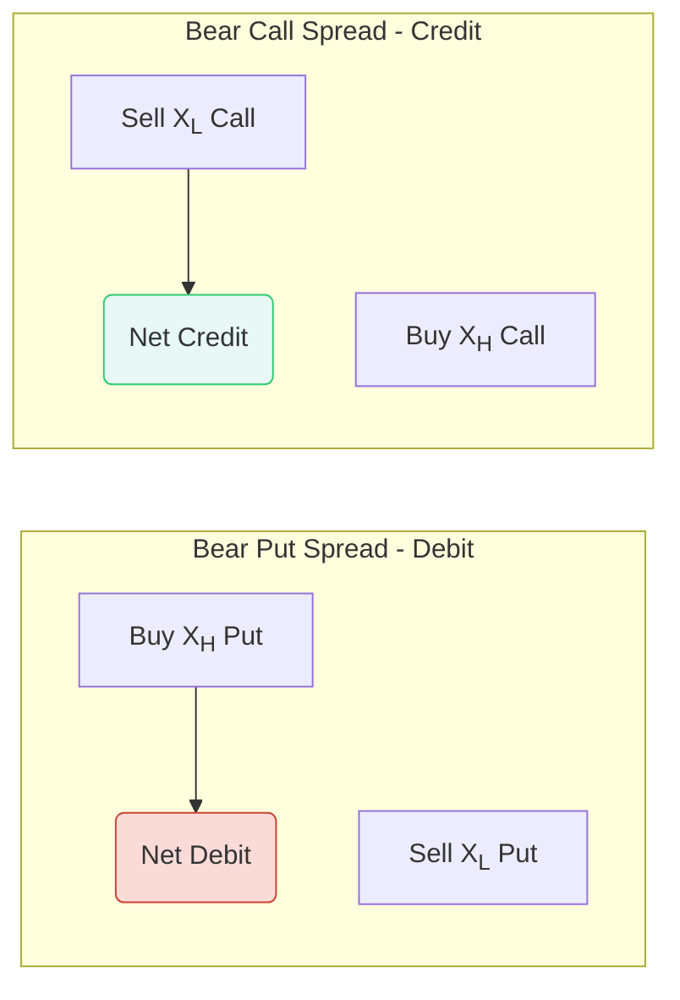

Greetings, Stock Options Samurai\! 🗡️ Having mastered the Bull Spread, you are now ready to face the market's opposite, yet equally important, direction: the decline.

Chapter 8 introduces the **Bear Spread**, which is essentially the mirror image of the Bull Spread. This strategy is for the Samurai who believes the terrain is falling but wants to control risk and define their profit potential.

-----

## Chapter 8: Bear Spreads — The Controlled Descent 📉

### 🎯 The Strategy: Definition and Philosophy

A **Bear Call Spread** or **Bear Put Spread** (collectively, Bear Spreads) is a two-part options strategy designed for traders who are **bearish** and expect the underlying stock price to decline.

Like the Bull Spread, it is a **vertical spread**—both options use the **same expiration date** but **different striking prices**.

#### **1. The Bear Put Spread (The Debit Bear)**

The Bear Put Spread is the most intuitive and common type of Bear Spread, as it's entered for a **Net Debit** (you pay money upfront, just like buying a single option).

| Action | Option Details | Impact |
| :--- | :--- | :--- |
| **Buy (Go Long)** | A Put Option at a **Higher Striking Price** ($X_H$). | This is the profitable leg if the stock falls; it costs more. |
| **Sell (Go Short)** | A Put Option at a **Lower Striking Price** ($X_L$). | This is the financing leg; it brings in premium. |
| **Net Result** | You pay a **Net Debit**. | Your risk is the net debit paid. |

#### **2. The Bear Call Spread (The Credit Bear)**

The Bear Call Spread is the exact functional equivalent of the Bear Put Spread but is established for a **Net Credit** (you receive money upfront).

| Action | Option Details | Impact |
| :--- | :--- | :--- |
| **Sell (Go Short)** | A Call Option at a **Lower Striking Price** ($X_L$). | This is the **risk-generating** leg, but it brings in a large premium. |
| **Buy (Go Long)** | A Call Option at a **Higher Striking Price** ($X_H$). | This is the **protection** leg; it caps your risk. |
| **Net Result** | You receive a **Net Credit**. | Your risk is the difference between the strikes minus the credit received. |

**Bear Spread Structure: The Mirror Image**

*Both spreads profit from a falling stock, but one is a Debit, and one is a Credit.*

-----

### ⚖️ Risk, Reward, and Key Formulas

Like the Bull Spread, the Bear Spread is a limited-risk, limited-reward strategy. The formulas are the same in structure, whether you use Puts or Calls.

**Let $D$ = Net Debit (for Put Spread), $C$ = Net Credit (for Call Spread)**
**Let $S$ = Spread Width = $X_H - X_L$**

#### **The Bear Spread Metrics (The Samurai’s Defensive Shield)**

| Metric | Bear **Put** Spread (Debit) | Bear **Call** Spread (Credit) |
| :--- | :--- | :--- |
| **Maximum Loss** | **Net Debit ($D$)** Paid + Commissions | **Spread Width ($S$) - Net Credit ($C$)** |
| **Maximum Profit** | **Spread Width ($S$) - Net Debit ($D$)** | **Net Credit ($C$)** Received |
| **Break-Even Point (BEP)** | $X_H - \text{Net Debit} (D)$ | $X_L + \text{Net Credit} (C)$ |

The maximum profit for **both** strategies is achieved if the stock price is at or below the **Lower Striking Price ($X_L)$** at expiration.

#### **Example Calculation (Bear Call Spread)**

  * **Stock XYZ:** Trading at $52
  * **Strategy:** Sell the Oct $50 Call for $4.00 ($X_L$). Buy the Oct $55 Call for $1.50 ($X_H$).
  * **Net Credit ($C$):** $4.00 - $1.50 = **$2.50\*\* (or $250 per spread).

<!-- end list -->

1.  **Maximum Profit:** **$2.50** (The Net Credit received).
2.  **Break-Even Point (BEP):** $50 (Lower Strike) + $2.50 (Net Credit) = **$52.50\*\*. (If the stock stays below this price, you profit).
3.  **Maximum Loss:** ($55 - $50) - $2.50 = $5.00 - $2.50 = **$2.50\*\* (The loss is capped).

-----

### 🧐 Debit Spread vs. Credit Spread: The Strategic Choice

The choice between a Bear Put (Debit) and a Bear Call (Credit) is primarily about **Implied Volatility (IV)**.

| Spread Type | Preferred IV Environment | Strategic Rationale |
| :--- | :--- | :--- |
| **Bear Put (Debit)** | **Low IV** | You are **buying** a put, making the long leg the most expensive component. You want to buy options when they are relatively cheap. |
| **Bear Call (Credit)** | **High IV** | You are primarily **selling** a call, making the short leg the most valuable component. You want to sell options when they are relatively expensive (inflated premium). |

**Mnemonic: C-H-O-P** (Credit spreads love High IV, Debit spreads love Opposite of High IV)

  * **C**redit spreads want **H**igh IV.
  * **O**utright (Debit) spreads want **P**oor (Low) IV.

#### **The Risk of Assignment**

For the **Bear Call Spread**, your short option is the $X_L$ Call. If the stock rallies and the $X_L$ Call is **In-the-Money**, you risk being assigned the stock.

  * **Response:** If assigned, you will be **Short 100 shares** of stock. To hedge, you immediately exercise your long call ($X_H$) to buy 100 shares. This results in the locked-in max profit/loss, but it involves transaction costs and potential confusion.
  * **Best Practice:** Close the entire spread before expiration if the stock is near the strikes.

-----

### 📝 Strategic Applications

#### **1. Portfolio Hedge (The Protective Veil)**

Bear spreads are excellent, low-cost hedges for a common stock portfolio, especially if you expect a short-term correction.

  * **Advantage over Outright Put Purchase:** A Bear Put Spread is always cheaper than buying a single Put for the same protection, making it a better choice for broad, low-cost portfolio insurance.

#### **2. Capitalizing on Price Inefficiency**

A skilled Samurai might find a market inefficiency that dictates the use of a specific spread:

  * If the lower strike Call ($X_L$) is overpriced relative to the higher strike Call ($X_H$), the **Bear Call Spread** will offer a higher net credit and is thus the preferred strategy. The market is giving you an opportunity to collect an unusually high premium.

The Bear Spread completes the basic directional strategies. Once you master the Bull and Bear Spreads, you have the foundational tools to profit whether the market moves up or down, all while keeping your risk perfectly defined.